#介绍
---
近几年来，客户端应用程序关于传输动态，定制内容的驱动力有了显著上升。从以往来说，这种内容加载的方式已经可以通过布局指令和脚本功能相结合的模式来实现了。这种模式可以通过编程的方式修改规范数据格式，修改布局（例如html和javascript）。这种模式现在发展到可以通过在嵌入对象，扩展布局属性和脚本引擎之间的协作完成更加精细的操作。这种新的互操作性促进了跨技术和平台的无缝对接的用户体验的建立。
本文旨在讨论软件互操作性层面的安全隐患，尤其关注几种突出的Web浏览器技术。我们将在文中揭示大量由允许互操作性而导致的攻击面，并讨论存在其中的几种独特类型的漏洞。灵台，我们将探讨互操作特性在主机应用程序的实现对系统安全性的影响，具体来说，我们将演示由于信任某些可插拔组件而导致的系统安全功能的破坏。虽然本文主要关注目前Web浏览器中存在的几个存在互操作性的层面，但是很多漏洞和审计策略的讨论同样适用于可以执行组件之间数据交换的软件之中。这类软件通常包括脚本语言，插件结构，RPC堆栈和虚拟机等。
##本文组织结构
本文主要分为三个部分。首先在[第一个部分](#第一节	攻击面)，我们将对各种攻击面有一个简单的介绍。具体来说，就是梳理通用的浏览器体系结构，并重点介绍与攻击互操作性层面相关的组件；[第二部分](#第二节	技术概述)将对两个流行的浏览器（Microsoft Internet Explorer（IE）和Mozilla Firefox）中攻击互操作性组件的技术细节进行剖析；[第三部分](#第三节	针对互操作性的攻击)将列举在已经识别的攻击面中出现的漏洞类型，并提供发现此类问题的实用方法；最后，本文将对作者发现的一些实际存在的关键漏洞进行讨论。

#第一节	攻击面
---
在深入讨论目标的软件层面之前，从概念层面了解攻击面是非常重要的。图1显示了当代Web浏览器的高级架构图，在图中我们看到的是与本文相关的部分组件。

<center>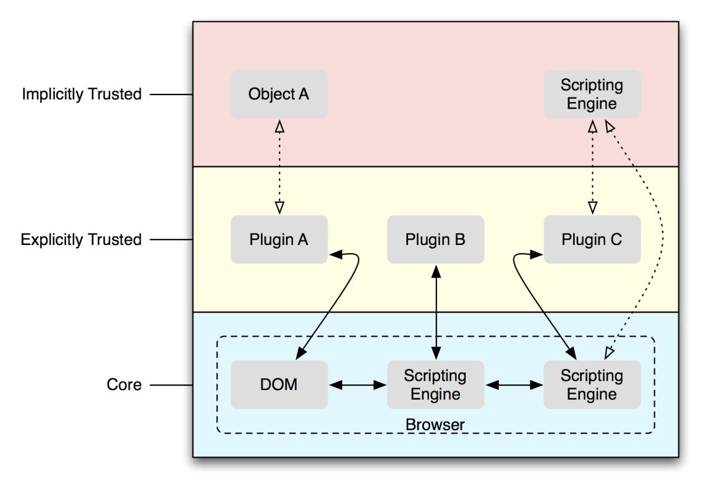</center>
<font color='#0000dd'><center>图1	Web浏览器高级架构图</center></font>

我们可以看到，图1分为三个逻辑层次。第一层，是浏览器核心，该层次包括为插件与浏览器提供交互环境的几个组件。这些插件主要是通过脚本来控制的，但是在某些情况下，它们也可以直接与浏览器的文档对象模型（DOM）进行交互。

第二层是插件本身。插件本质上就是浏览器加载的对象，它们通过处理特定的文档类型来实现其他的功能。浏览器可以很明确的通过策略配置选择信任或者拒绝插件运行，但是它们有时可能会在浏览器的单独进程中运行。。例如IE8浏览器在Windows vista 或者win7系统上运行时，会在限制较多的“低完整性”上下文中运行，部分插件则会在限制较少的“中等完整性”上下文中运行，导致多个插件运行时会耗尽进程资源。这个策略会允许插件在浏览器中得到完全信任，而操作系统上下文中配置得到较低的信任。

最后，第三层是隐式授信对象，及受信任的插件可以加载以便于扩展自身功能的对象。由于浏览器显式地将插件（插件X）作为授信对象，且插件X的授信级别会扩展到任意对象（对象Y），所以我们说，浏览器和授信插件加载的任意对象之间存在可传递的信任关系（B - > X，X - > Y，因此B - > Y）。我们将在文章的第二部分用实例说明：扩展程序的信任传递关系可以允许攻击者利用插件及其可信组件破坏浏览器的安全模型。第三层中另一个需要注意的部分是：在很多情况下，一些浏览器插件会通过自定义功能的脚本与浏览器提供的脚本引擎或DOM进行交互。事实上，这种情况在很多流行插件中都有法身个，比如Adobe Flash，Sun Java和Mircosoft Silverlight等。在这些情景之下，授信关系由软件隐式调用的插件中传递出来，这就允许攻击者利用这样的信任关系获许使用脚本语言所能完成的所有功能。此外，攻击者还可以从脚本语言中将精心构造的对象注入到浏览器进程上下文中，由于信任传递性的关系，这些对象就可能被脚本引擎之外的DOM或者其他插件操纵，有时候会产生意想不到的后果。

信任扩展并不是互操作特性唯一的安全代价。从图1可以看出，为了使每个附加的组件相互交互，互操作的组件之间必须建立通信桥（由图1的双向箭头表示）。这些通信桥本身就是一个相当大的攻击面：通信桥的功能是负责将数据从一个组件编组导出到另一个组件，而编组的过程协作组件对本地组件数据结构隐式的转换。这一操作过程在某种程度上是静默执行的，所以在尝试发现漏洞时，这一过程往往会被忽略。实际上，目前在针对浏览器插件对象的安全评估上已经由大量可检索的资料了，但是很少出现关于检查互操作性的信息。本文恰恰是想要改善对这一角度缺乏审查的现状。

互操作性是各种独特漏洞发育的温床，这类漏洞此前并未被大量的挖掘出来（文章时间2009年，译者注）。由于这些操作，数据结构编组的基础框架往往会导致类型混淆（由于类型误解而导致数据误用）和对象保留（虚假引用计数问题）相关的漏洞，这类问题在其他领域往往是很少见的。虽然这类漏洞此前只是偶尔被发掘出来，但是我们要向大家展示目标软件中流行的API是如何容易受到攻击，同时我们也会在第二部分提供发掘这类漏洞的策略。我们应该注意的是，**尽管本文中提到的体系结构是以Web浏览器为中心，但是这类问题在任何软件中都是系统性的，因为很多软件都会为不同组件处理数据提供内部协作的平台。**
#第二节	技术概述
---
为了说明本文提出的“攻击互操作性”的概念，本节将提供部分相关技术研究的案例作为说明。本节的案例包括Internet Explorer中的ActiveX控件架构，以及Mozilla的NPAPI插件架构（主要存在于Firefox, Google Chrome及其他一些非浏览器应用程序中）。这一节中我们将探讨如何在可用的通用脚本语言中表示对象，如何将他们编组并导出到插件入口点，以及如何进行DOM交互。最后我们将提供ActiveX和NPAPI的攻击面摘要，总结每种技术在攻击面中所扮演的不同角色。

##MircoSoft ActiveX

ActiveX是一种源于微软COM技术的技术。它用于创建可以暴露给Runtime引擎（例如JavaScript和VBScript）的插件，以便于为宿主应用程序提供额外的功能。为了在第三节中更好地探讨这些漏洞，我们需要深入了解关于COM/Automation架构的知识内容。因此，我们在本节中讨论相关的技术。另外，我们还将探讨“持久化对象”的概念，它是序列化的COM对象，可以嵌入到网页当中。第三节，我们将介绍关于利用持久COM对象作用于COM编组组件中的漏洞，同时破坏浏览器安全功能的方法。
###插件注册

ActiveX空间是COM对象的特例，因此在系统注册表中会有一个描述实例化信息的表项。与其他所有的COM对象一样，每个ActiveX对象都会有一个唯一个Class ID （CLSID）标识，键值信息位于HKEY_CLASSES_ROOT\CLSID\{<CLSID>}这个表项中。此外，HKEY_CURRENT_USER这个表项也可以用于存储针对每个用户安装的对象。由于COM对象在Windows操作系统中非常广泛的使用，IE浏览器需要通过一种机制去限制Web浏览器允许启动哪些COM对象。随着时间的推移，安全机制的定义变得更加细化，这里将进行简要叙述。
####ActiveX插件：安全控件
IE浏览器有几种确定ActiveX对象是否具有执行权限的机制。控件的安全权限分为两类：初始化和脚本。初始化安全指的是是否允许来自持久COM流中的数据来进行控件的实例化（稍后将深入讨论）；脚本安全指的是是否可以通过运行时公开的脚本API来对控件进行操作。有关ActiveX安全控件的完整描述，请访问Microsoft网址http://msdn.microsoft.com/en-us/library/bb250471(VS.85).aspx，本节中大部分逆向工程之外的信息内容均来自此网页。
#####注册控件
将控件标记为脚本（Safe for Scripting，SFS）或安全初始化（Safe for Initialization，SFI）的第一个广为人知的方法是在注册表相应控件表项中添加子键。在Implemented Categories子表项中添加两个值7DD95801-9882-11CF-9FA9-00AA006C42C4 (CATID_SafeForScripting) 和7DD95802-9882-11CF-9FA9-00AA006C42C4 (CATID_SafeForInitialization)即可标记SFS和SFI。图2内容展示了此类控件的示例。
<center>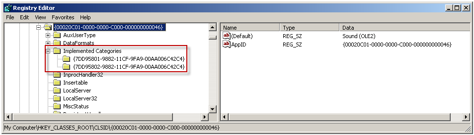</center>
<font color='#0000dd'><center>图2	将ActiveX控件标记为SFS和SFI的方法</center></font>

控件可以使用StdComponentCategoriesMgr对象程序化地注册自身。IcatRegister接口包括RegisterClassImplCategories()方法，该方法可用于处理所有给定COM对象的类别注册信息。所以StdComponentCategoriesMgr使用上述方法更新注册表。
IE浏览器也使用StdComponentCategoriesMgr对象，但是是用于枚举而非注册。IcatInformation结构提供了一个名为IsClassOfCategories()的函数，IE可以通过调用该函数来确定控件是SFS还是SFI，这个函数内部实现即为查询上述注册表项的键值以确定控件的属性信息。<http://msdn.microsoft.com/en-us/library/ms692689(VS.85).aspx>对组件类别管理的信息进行深度介绍。

####IObjectSafety接口

控件标记SFS和SFI存在可替代方法：ActiveX控件可以通过实现IObjectSafety接口为安全限制需求提供支持。使用这种方法时，需要调用IObjectSafety::GetInterfaceSafetyOptions()方法，返回控件的安全性。该方法原型如下：

```
HRESULT IObjectSafety::GetInterfaceSafetyOptions(
	REFIID riid,
	DWORD *pdwSupportedOptions,
	DWORD *pdwEnabledOptions
);
```

IE通过调用这个函数来确定支持的安全选项集合，如果接口返回值显示支持安全选项，IE会调用IObjectSafety接口的SetInterfaceSafetyOptions() 方法表明它希望执行对象。该方法的函数原型如下：

```
HRESULT IObjectSafety::SetInterfaceSafetyOptions(
	REFIID riid, 
	DWORD dwOptionSetMask, 
	DWORD dwEnabledOptions
);
```

如果GetInterfaceSafetyOptions()方法成功返回，则表明应用程序知道对象符合应用程序对安全选项的要求，可以使用COM对象。这个API在COM类别的附加信息是：控件可提供关于如何使用控件的更细粒度的控制方法，因为它能够根据riid参数中指定的接口ID信息为不同的接口指定不同的安全设置信息。另外，IObjectSafety接口可以执行本地代码以确定创建对象的应用程序是否可以安全地执行该操作。Mircosoft提供的SiteLock模板代码是这类操作方法的一个实例，该模板代码允许程序员将ActiveX控件限制为预设的URL列表。

####ActiveX Killbits
IE也通过允许管理员专门禁止某一浏览器中实例化的控件实现了对标准安全功能的覆盖。这种方法是通过HKEY_LOCAL_MACHINE \ Software \ Microsoft \ Internet Explorer \ ActiveX Compatibility注册表项中添加一个子项来实现的。子项中必须有控件的CLSID，并包含一个DWORD值“Compatibility Flags”。这个值被设置为0x400（killbit）。图3即为给控件设置killbit的实例：
<center>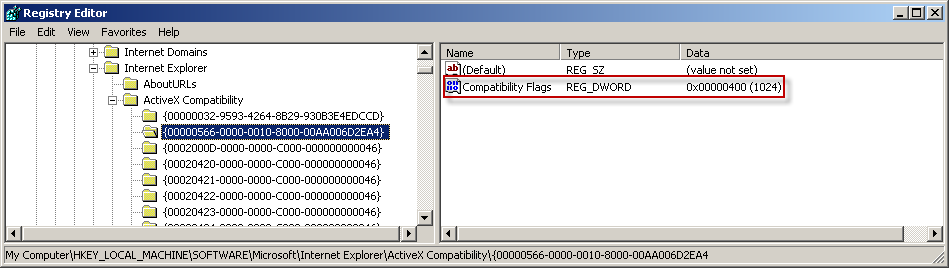</center>
<font color='#0000dd'><center>图3	killbit设置图</center></font>

当应用程序想要确定一个控件是否设置killbit时，可以通过调用CompatFlagsFromClsid()函数来实现，这个函数是urlmon.dll的一个导出函数，函数原型如下：

```
HRESULT CompatFlagsFromClsid(
	CLSID *pclsid, 
	LPDWORD pdwCompatFlags, 
	LPDWORD pdwMiscStatusFlags
);
```

当应用程序调用此函数时，它将传入目标COM对象的CLSID，以及两个DWORD指针，指针的值会等于函数成功返回时对象的兼容性及其他OLE标志。然后应用程序将判断是否有0x400（killbit）以确定控件是否设置了killbit。
如果设置了killbit，注册表中会出现一个表示备用ClassID的新条目。这个备用ClassID会被用来代替Internet Explorer中原始 Class ID。图4显示了一个使用备用Class ID 的Class ID的注册表项。当处理图4中的控件时，IE会将COM对象的CLSID由{41B23C28-488E-4E5C-ACE2-BB0BBABE99E8} 转化为 {52A2AAAE-085D-4187-97EA-8C30DB990436}.。

<center>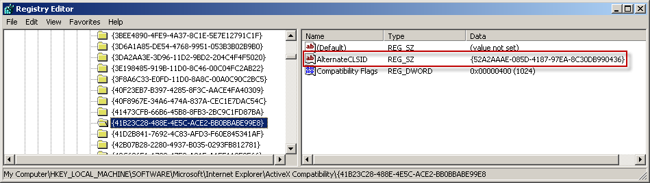</center>
<font color='#0000dd'><center>图4	带有备用CLSID的COM对象</center></font>

####预批准列表和ActiveX Opt-In
Microsoft在Internet Explorer 7中引入了一项名为ActiveX Opt-In（选择性加入）的功能。该功能旨在通过允许在网页在实例化未加载对象或此前IE为安装的对象之前向用户发起通知来减少浏览器被攻击的可能。图5显示了注册表HKEY_LOCAL_MACHINE \ Software \ Microsoft \ Windows \ CurrentVersion \ Ext \ PreApproved键值的配置信息

<center>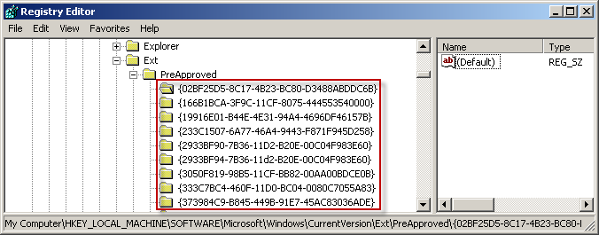</center>
<font color='#0000dd'><center>图5 系统注册表中预批准列表的键值</center></font>

Windows系统基本安装中，已经由很多控件加入预批准列表当中。但是更多的安全脚本或初始化控件并没有出现在这个列表当中，该功能为列表中涵盖的控件的漏洞发现提高了可能性。

####每个用户ActiveX的安全性

IE8引入了一系列预安全浏览相关的附加安全功能，这些功能包括对ActiveX的一些改进。在添加这些功能之前，可以在每台计算机上配置控制权限。新增的功能将killbit的力度由每台机器细化到每个用户，并通过允许基于用户和域的选择性加入功能扩展ActiveX的opt-in。
传统来说，killbit可以有效地禁止整个控件系统的实例化。在许多用户系统上单个用户需要而其他用户不需要它的情况下，这个模型还是存在问题的。Microsoft通过引入注册表项HKEY_CURRENT_USER \ Software \ Microsoft \ Windows \ CurrentVersion \ Ext \ Settings \ {CLSID}扩展了killbits，其中CLSID是要限制的ActiveX控件的Class ID。将Flag值设为1，则可限制单个用户的控件。具体信息如图6所示：
<center>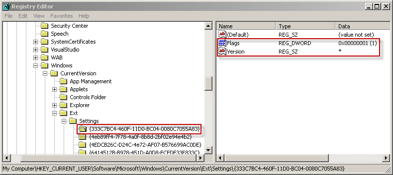</center>
<font color='#0000dd'><center>图6 单个用户控件限制示例</center></font>

将ActiveX控件限制到某些域的操作方式可以促使用户对ActiveX控件安全性进行更加精细的控制。最初，SiteLock是唯一允许域限制的方法，但是这种方法不能够由终端用户进行配置。 通过向注册表HKEY_CURRENT_USER \ Software \ Microsoft \ Windows \ CurrentVersion \ Ext \ Stats \ {CLSID} \ iexplore \ AllowedDomains，添加特定被允许域用户的秘钥，可以对域进行管理。 通配符“*”表示添加所有的域密钥，而不是特定域。     
每个域的选择加入控件通过要求用户在不熟悉的域的上下文中运行之前批准使用ActiveX控件来减少攻击面。 实际上，这需要攻击者将恶意Web内容插入受信任的域，以便偷偷地利用ActiveX控件。 图7显示了配置为在microsoft.com域内运行而没有提示的表格数据控件。

单个用户的选择性加入机制通过要求用户在执行不熟悉的域上下文中运行前确认ActiveX控件的方式来缩减攻击面。实际上，攻击者可以通过在授信的域名中插入恶意Web内容，偷偷地利用ActiveX控件。图7显示了表格数据控件允许在授信的mircosoft.com域运行前无需提示的配置信息。
<center>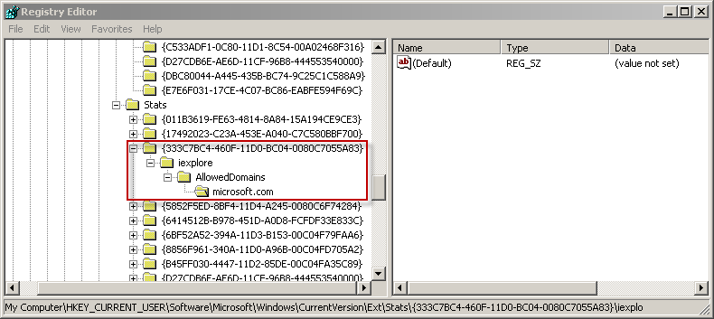</center>
<font color='#0000dd'><center>图7	表格数据控件配置信息</center></font>

####Internet Explorer 权限 GUI界面
除了提供限制功能外，Mircosoft还给InternetExplorer提供了一个增强界面。用户可通过该界面轻松配置ActiveX控件权限，无需修改注册表。图8显示了访问Add-on界面的方法，图9显示了在未经许可前提下查找允许浏览器运行dll的方法。

<center>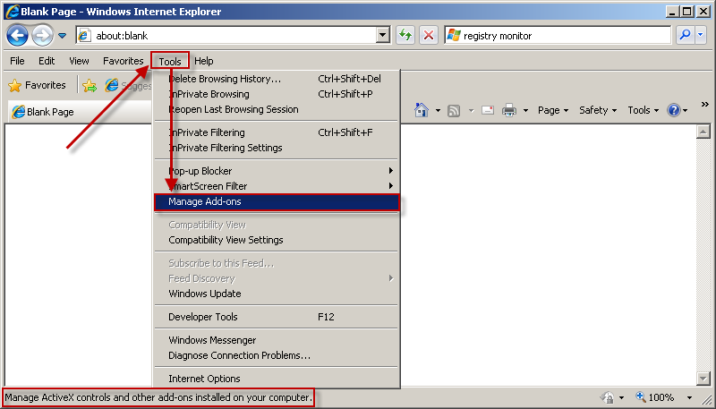</center>
<font color='#0000dd'><center>图8	Add-on管理界面</center></font>

<center>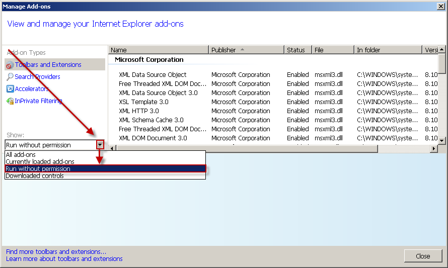</center>
<font color='#0000dd'><center>图9 未经允许的情况下查看控件运行状况的方法</center></font>

####ActiveX安全总结
ActiveX有许多限制可以加载哪些控件，以及如何在给定的上下文中对它们执行操作的方法。一个可能的原因是：随着应用程序互操作性的增加，攻击者可利用的机会也大大增加了。在这个前提下，ActiveX控件的安全性以攻击----响应的方式在发展，这也导致了ActiveX支离破碎的安全架构。在后面的内容中，我们将展示一种绕过这些限制的攻击方法。该方法主要利用了Mircosoft总是临时向浏览器补充安全功能，而不是从一开始就建立了强大的安全架构的因素。

###COM概述

COM是一种架构标准，它要求对象与语言无关，并促进了对象之间的相互交互。Mircosoft使用COM作为其很多主要技术的基础架构。COM在Windows旗舰操作系统上使用非常普遍，很多其他的外围产品也广泛使用COM架构，比如InternetExplorer和Office。在下一节（VARIANT）中，我们将讨论COM用于通信的基本数据类型以及数据操作的相关API。通过探讨“VARIANT”一节的内容，我们将为读者提供本文关注的漏洞类型中所需要的更多背景信息。“VARIANT”后的一节名为“COM 自动化”，这一节中我们简要探讨统称为ActiveX控件的暴露给运行时环境的COM对象子集。最后在“COM持久化概述”一节中，我们将讨论持久化的概念——序列化COM对象当前状态及随后复活该对象的能力。我们将结合潜在的恶意环境讨论或不可信来源的序列化对象持久化的使用方法（常见于恶意网页和办公文档）。

####Variants

VARIANTS是整个windows平台中用于标准、格式化表示任意数据类型的重要数据结构之一。它是COM的组成部分，用于在两个或多个通信对象之间交换数据。VARIANTS的数据结构相对简单，由类型和值组成，并且在Windows SDK中的OAldl.h中定义，定义如下：

```
struct __tagVARIANT
{
	VARTYPE vt;
	WORD wReserved1;
	WORD wReserved2;
	WORD wReserved3;
	union
	{
		BYTE bVal;
		SHORT iVal;
		FLOAT fltVal;
		DOUBLE dblVal;
		VARIANT_BOOL boolVal;
		… more elements …
			BSTR bstrVal;
		IUnknown *punkVal;
		IDispatch *pdispVal;
		SAFEARRAY *parray; VARIANT_BOOL *pboolVal;
		_VARIANT_BOOL *pbool;
		SCODE *pscode;
		CY *pcyVal;
		DATE *pdate;
		BSTR *pbstrVal;
		VARIANT *pvarVal;
		PVOID byref;
	} __VARIANT_NAME_1;
};

```
Variant结构体的成员可以产生多种类型的变换，因此只有VT成员给出上下文时才有意义。Variant可以表示很多种基本类型，一些常见的类型如表10所示


|Type Name |Value |Union Contains |
|----------------|--------|----------------------|
|VT_EMPTY |0x0000 |Undefined |
|VT_NULL|0x0001|NULL value|
|VT_I2|0x0002|Signed (2-byte) short|
|VT_I4|0x0003|Signed (4-byte) integer|
|VT_R4|0x0004|Signed (4-byte) real (float)|
|VT_R8|0x0005|Signed large (8-byte) real (double)|
|VT_BSTR|0x0008|String; Pointer to a BSTR|
|VT_DISPATCH|0x0009|Pointer to an IDispatch interface (automation object)|
|VT_ERROR|0x000A|Error code (4-byte integer)|
|VT_BOOL|0x000B|Boolean (2-byte short)|
|VT_VARIANT|0x000C|Pointer to another VARIANT|
|VT_UNKNOWN|0x000D|Pointer to an Iunknown interface (any COM object)|
|VT_I1|0x0010|Signed (1-byte) char|
|VT_UI1|0x0011|Unsigned (1-byte) char|
|VT_UI2|0x0012|Unsigned (2-byte) short|
|VT_UI4|0x0013|Unsigned (4-byte) integer|
|VT_RECORD|0x0024|Pointer to an IrecordInfo interface (used to represent user-defined |

<font color='#0000dd'><center>表10	Variant的基本数据类型</center></font>

如上表所见，除了各种COM接口类型外，Variant可以表示所有的基本数据类型。另外，Variant也可以支持用户通过IRecordInfo COM接口定义的数据类型。这个接口提供了自定义对象的大小和编组函数，以便于表示其他数据结构。上表中列出的数据类型是Variant所有支持类型的子集，可用类型的完整列表可以从Windows SDK中的wtypes.h中找到。
除了基本类型意外，还有几个修饰符。当修饰符与基本类型结合使用时，会替换_VARIANT_NAME_1联合中内容的原有含义。修饰符是不能单独使用的，它们需要为基本类型提供附加上下文信息，并将修饰符的值与基本类型的值进行组合使用。表11总结了修改性质的修饰符及其各自的含义。

|Modifier Name|Modifier Value|Value|
|------------------|------------|-----------------|
|VT_VECTOR|0x1000|Value points to a simple counted array (Rarely used)|
|VT_ARRAY|0x2000|Value points to a SAFEARRAY structure|
|VT_BYREF|0x4000|Value points to base type, instead of containing a literal of the base type 

<font color='#0000dd'><center>表11	variant 修饰符类型表</center></font>

如上表所示，基本类型的值都小于0xFFF，而修饰符的值都大于0xFFF。所以可以通过简单的掩码操作用修饰符扩充基本类型。比如包含字符串数组的Variant将含有VT_ARRAY|VT_BSTR，其成员值指向每个成员都是BSTR的SAFEARRAY。（SAFEARRAY可以在更短时间内进行更加深入的检查）VARIANT可以通过类型VT_BYREF | VT_I4表示指向有符号整数的指针。 VT_BYREF修饰符也可以与其他修饰符一起使用，因此VARIANT可以含有类型（VT_BYREF | VT_ARRAY | VT_BSTR）。在这种情况下，value成员将指向SAFEARRAY指针，其成员都是BSTR类型。

####安全数组
数组是COM使用的常见数据结构，存在于VARIANT VT_ARRAY修饰符的vt字段中。在这种情况下，SAFEARRAY可用来封装相同数据类型的一系列元素，同时也提供了一系列SafeArray的API，以便于安全地访问数组成员。虽然它们常常表示单一维度的数组，但是SAFEARRAY也能够表示不同大小的多维数组（锯齿状数组）。SAFEARRAY结构体定义在windows SDK中OAldl.h中，如下所示：

```
typedef struct tagSAFEARRAY
{
	USHORT cDims;
	USHORT fFeatures;
	ULONG cbElements;
	ULONG cLocks;
	PVOID pvData;
	SAFEARRAYBOUND rgsabound[1];
} SAFEARRAY;
```

SAFEARRAY中包含的元素大小为cbElements，并且连续存储在内存区域中，地址存放在pvData成员中。SAFEARRAYBOUND结构数组跟在内存中的SAFEARRAY描述符之后，每个SAFEARRAYBOUND结构描述数组的单个维度。 SAFEARRAYBOUND结构构造如下：

```
typedef struct tagSAFEARRAYBOUND
{
	ULONG cElements;
	LONG lLbound;
} SAFEARRAYBOUND;
```

简单来说ILbound成员表示所描述维度的下限，cElements成员表示该维度中存在的成员数。
SAFEARRAY API相对来说比较多，所以我们只考虑操作数据结构的常用API。下面两个API用于初始化和销毁，彼此互为补充。  

```
SAFEARRAY *SafeArrayCreate(VARTYPE vt, UINT cDims, SAFEARRAYBOUND * rgsabound); 
HRESULT SafeArrayDestroy(SAFEARRAY * psa);
```

这些函数分别用于创建和销毁数组，创建数组时，将指定每个数组成员的数据类型以及数组的维度。这些属性在SAFEARRAY创建后都是无法改变的。关于数组内的数据访问，有两种方式。第一种是获取数组元素所在内存的指针，由以下函数完成：

```
HRESULT SafeArrayAccessData(SAFEARRAY * psa, void HUGEP** ppvData);
HRESULT SafeArrayUnaccessData(SAFEARRAY * psa);
```

这种方法常见于循环访问数组中的数据时，具体方法如下：

```
BSTR *pString;
if (FAILED(SafeArrayAccessData(psa, &pString))
	return -1;
	for (i = 0; i < psa->rgsabound[0].cElements; i++)
	{
		… operate on string …
	}
SafeArrayUnaccessData(psa);
```

第二种方法是利用如下函数直接访问独立的元素：

```
SafeArrayGetElement(SAFEARRAY * psa, LONG * rgIndices, void * pv);
SafeArrayPutElement(SAFEARRAY * psa, LONG * rgIndices, void * pv);
```

这两个函数都是通过获取数组的索引，返回或存储有问题的特征值。两个函数内部都会验证提供索引的有效性，以确保不会产生数组访问越界的行为。
最后，SAFEARRAY内部有确保数组独占线程访问的锁机制，由以下两个函数实现：

```
HRESULT SafeArrayLock(SAFEARRAY * psa); 
HRESULT SafeArrayUnlock(SAFEARRAY * psa);
```

####VARIANT与VARIANTARG
许多VARIANT API函数采用VARIANT或VARIANTARG。 Microsoft的文档中说到，这两个值之间的差异是：VARIANT总是包含直接值（即它们不带有修饰符VT_BYREF），而VARIANTARG可以包含修饰符。 实际上，您会在VARIANT API的讨论中注意到：大多数Variant \*函数都采用VARIANTARG。 实际上，这些结构是等效的，并且可以互换使用，具体方法在其他文档里有说明。 此外，当他们互换使用时，不会产生编译错误。 （微软关于他们所谓的区别的文档可以详见<http://msdn.microsoft.com/en-us/library/ms221627.aspx>.)

####VARIANT API
操作VARIANT的API有很多，但是只有少数函数与本文有关，本节将对他们逐一讨论。

#####VARIANT 初始化和销毁
Variant是利用VariantInit()进行初始化的，函数原型如下：

`HRESULT VariantInit(VARIANTARG *pvarg);`

这个函数就是确定Variant的类型成员vt变为VT_EMPTY,此时VARIANT不保留任何值，稍后会使用反函数VariantClear()清理VARIANT。

`HRESULT VariantClear(VARIANTARG *pvarg);`

VariantClear()函数会清理vt成员，同时也会释放所有与Variant有关系的数据。比如，如果一个VARIANT包含IDispatch或者IUnknown接口，VariantClear()API会释放改接口，如果VARIANT是一个字符串，则取消分配，以此类推。
VARIANT 的操控
VARIANT可被API执行的两种操作是类型的转换和复制。有很多以VarXXFromYY()形式的API可以用来转换VARIANT，其中XX是目标VARIANT类型，YY是源类型。另外还有支持任意两种VARIANT类型转换的函数，如下所示：

HRESULT VariantChangeType(VARIANTARG \*pvargDest, VARIANTARG \*pvargSrc, unsigned short wFlags, VARTYPE vt);
HRESULT VariantChangeTypeEx(VARIANTARG \*pvargDest, VARIANTARG \*pvargSrc, LCID lcid, unsigned short wFlags, VARTYPE vt);

这两个函数完成的功能基本相同——将pgargSrc转换为vt指定的类型。这些功能将在第三节详细讨论。
另外，还有两个值得一提的函数：将VARIANT的值复制到另一个VARIANT的函数

```
HRESULT VariantCopy(VARIANTARG \*pvargDest, VARIANTARG \*pvargSrc);
HRESULT VariantCopyInd(VARIANTARG \*pvargDest, VARIANTARG \*pvargSrc);
```

这两个函数都是确认目的VARIANT并复制源VARIANT的值，复制过程是深层次的。如果COM接口也可以复制，那么引用计数就会递增。两个函数的不同点在于VariantCopyInd()函数会遵循副本的间接引用（及如果VARIANT带有VT_BYREF修饰符，该值会被解除引用并修改），而VariantCopy()则不会。另外，VariantCopyInd()支持递归，如果源VARIANT具有类型（VT_BYREF | VT_VARIANT），则会递归查找VARIANT，如果新的VARIANT类型也是（VT_BYREF | VT_VARIANT）则发送错误信号。如果VARIANT有 VT_BYREF修饰符但不是VT_VARIANT，则此VARIANT将再次传递给VariantCopyInd()，从而检索存储的值。
####COM 自动化
前面提到过，COM自动化有助于在脚本环境中继承可插入组件。具体实现是创建一个或两个半自动化的接口对象：IDispatch和IDispatchEx。设计这两个函数的目的是为了完成如下操作：

	1.	允许对象自我公开：即声称自身的属性和方法
	2.	允许通过名称调用方法和属性，避免直接对VTable或内存进行操作
	3.	为传递方法和属性的目的对象和返回到脚本主体的对象提供统一的编组接口

通过实现IDispatch，对象可以在运行时由host应用程序进行加载并进行后续操作，而host无需了解任何关于对象编译时的详细信息。这个功能对可扩展的脚本接口来说特别有用。
IDispatch接口派生自IUnknown（MSDN上有记录），四种添加的方法如下所示：

```
/*** IDispatch methods ***/
HRESULT(STDMETHODCALLTYPE *GetTypeInfoCount)(
	IDispatch* This,
	UINT* pctinfo);
	
HRESULT(STDMETHODCALLTYPE *GetTypeInfo)(
	IDispatch* This,
	UINT iTInfo,
	LCID lcid,
	ITypeInfo** ppTInfo);
	
HRESULT(STDMETHODCALLTYPE *GetIDsOfNames)(
	IDispatch* This,
	REFIID riid,
	LPOLESTR* rgszNames,
	UINT cNames,
	LCID lcid,
	DISPID* rgDispId);
	
HRESULT(STDMETHODCALLTYPE *Invoke)(
	IDispatch* This,
	DISPID dispIdMember,
	REFIID riid,
	LCID lcid,
	WORD wFlags,
	DISPPARAMS* pDispParams,
	VARIANT* pVarResult,
	EXCEPINFO* pExcepInfo,
	UINT* puArgErr);
```
	

如果一个应用程序调用这个对象公开的属性和方法，首先需要确定与要调用方法关联的ID。确定这个ID，首先会通过GetIdsOfname()函数，返回一个整数值。该值会映射通过Invoke()方法实际实现的方法。Invoke()方法会获取将要执行成员的ID，方法的参数和一些与语言环境等信息有关的其他信息作为参数。传递给Invoke()的wFlags参数定义了调度ID是表示调用对象公开的方法还是获取或设置的属性值。想要执行的方法DISPPARAMS结构体进行传参。该结构体定义如下：

```
typedef struct FARSTRUCT tagDISPPARAMS {
	VARIANTARG FAR* rgvarg; // Array of arguments. 
	DISPID FAR* rgdispidNamedArgs; // Dispatch IDs of named arguments. 
	Unsigned int cArgs; // Number of arguments. 
	Unsigned int cNamedArgs; // Number of named arguments. 
} DISPPARAMS;
```

如您所见，这个结构体向VARIANTS数组中的方法传递参数，（详细信息请查阅VARIANT部分）。这个数组必须通过调用的方法进行拆解。在某些情况下，考虑到数组中可能存在的某些VARIANT的复杂性，拆解可能是一项艰巨的任务。

IDispatch接口对于创建行为不可变（即必须在编译时知道属性和方法，且不会改变）的自动化对象非常有用。 但是，在某些情况下，需要具备可在运行时修改行为的对象， IDispatchEx接口扩展IDispatch以允许此附加功能。 使用IDispatchEx对象，可以在运行时添加或删除属性或方法。这种功能的需求场景常见于动态后期绑定的语言（例如脚本语言（例如JavaScript））中。
IDispatchEx也派生自IUnknown接口，并添加了以下八种方法：

```
HRESULT DeleteMemberByDispID(
	DISPID id
);
HRESULT DeleteMemberByName(
	BSTR bstrName,
	DWORD grfdex
);
HRESULT GetDispID(
	BSTR bstrName,
	DWORD grfdex,
	DISPID *pid
);
HRESULT GetMemberName(
	DISPID id,
	BSTR *pbstrName
);
HRESULT GetMemberProperties(
	DISPID id,
	DWORD grfdexFetch,
	DWORD *pgrfdex
);
HRESULT GetNameSpaceParent(
	IUnknown **ppunk
);
HRESULT GetNextDispID(
	DWORD grfdex,
	DISPID id,
	DISPID *pid
);
HRESULT InvokeEx(
	DISPID id,
	LCID lcid,
	WORD wFlags,
	DISPARAMS *pdp,
	VARIANT *pVarRes,
	EXCEPINFO *pei,
	IServiceProvider *pspCaller
);
```

虽然检索调度ID的方式存在一些差异，但IDispatchEx的主要变化是允许创建和删除对象属性和方法的操作。 例如，GetDispID()与GetIdsOfNames()的不同之处在于，GetDispID()可以被告知为新属性或方法创建新名称和调度ID。 此外，您还可以看到：接口添加了DeleteMemberByName()和DeleteMemberByDispID()方法。 在扩展IDispatchEx接口的ActiveX控件中，可以通过JavaScript完成成员的动态创建和删除操作。

有趣的是，JavaScript（用于Internet Explorer）本身是使用Microsoft公开的脚本引擎经过修改的IDispatchEx接口实现的。 从概念上讲，这种实现是有意义的，因为JavaScript需要能够创建对象并添加和删除所有成员，而不需要任何先入为主的概念。所以，比如当JavaScript创建一个新对象时：

`Obj = new Object();`

Internet Explorer将首先调用Obj的GetDispID()方法 - 确保将fdexNameEnsure标志设置为创建成员。 然后它将调用自己的内部版本的Invoke()来调用Object()方法。 然后，调用Invoke()返回的值将分配给Obj成员。

####COM持久化简述

COM为操作对象的持久化数据提供了两个接口。第一个接口IStream表示用于存储单个对象持久数据的数据流，这个接口包含标准文件操作，包括使用接口方法进行读取，写入和搜索。IStream接口从流的使用者处抽象出底层的存储细节。这个抽象过程允许COM对象在无需了解底层后备存储的前提下实现序列化功能。IStream的抽象如下所示：

<center>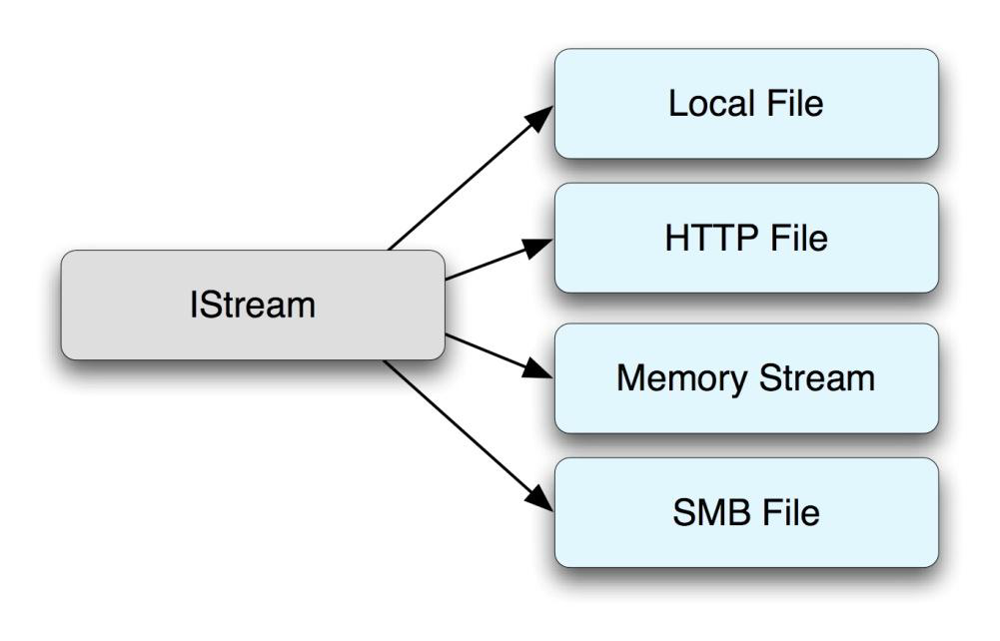</center>
<font color='#0000dd'><center>图12	可包含IStream流数据的媒介图</center></font>

当程序或COM对象需要多个对象的持久化时，会使用第二个接口IStorage。 IStorage表示一个存储文件，它可以使用唯一名称标识在单个文件中的不同二进制流保持逻辑上的分离以标识每个流。 此外，存储文件可以包含逻辑上独立的从属存储文件，也可以通过唯一名称访问，所以，在需要的时候可以递归访问。 IStorage接口提供的方法允许程序员访问每个组成流和从属存储文件。 图13描绘了典型存储文件的示例。

<center>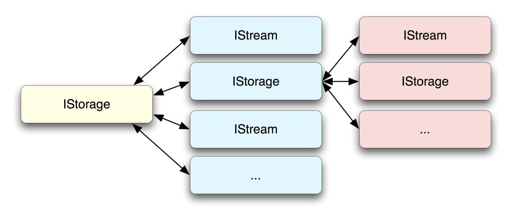</center>
<font color='#0000dd'><center>图13	Storage文件内容示例图</center></font>

除了上面两个接口外，还有其他可用于操作COM持久化数据的接口，接口选择由包含数据的介质决定。下面是可以存储持久对象数据的接口列表：

	.	IMoniker
	.	IFile 
	.	IPropertyBag 
	.	IPropertyBag2
	
COM对象通过实现几个众所周知的持续性接口中的一个来实现序列化。这些接口中，每一个都是IPersist接口的特例，它们的定义如下：

```
MIDL_INTERFACE("0000010c-0000-0000-C000-000000000046")
IPersist : public IUnknown
{
public:
virtual HRESULT STDMETHODCALLTYPE GetClassID(
	/* [out] */ __RPC__out CLSID *pClassID) = 0;
};
```

IPersist的每个子类都有名为Load()和Save()的方法，它们分别对数据进行序列化和复活（保存？译者注）。 这些子类之间的区别是保存持久数据的接口类型。 表14列出了持久化接口以及每个相应接口用于保存数据的参数类型。 图15直观地描述了这些接口的继承层次结构。

|Persistence Interface|Argument that Holds the Data|
|---------------------------|---------------------------------------|
|IPersistFile|An LPCOLESTR that designates a standard file path|
|IPersistMemory|An LPVOID that is a fixed-size memory buffer|
|IPersistMoniker|An IMoniker interface|
|IPersistPropertyBag|An IPropertyBag interface|
|IPersistPropertyBag2|An IPropertyBag2 interface|
|IPersistStorage|An IStorage interface|
|IPersistStream|An IStream interface|
|IPersistStreamInit|An LPSTREAM interface|

<font color='#0000dd'><center>表14	持久化接口和数据接口相关</center></font>

主机程序希望对对象进行序列化时，会查询该对象以获得持久化接口。如果成功，应用程序将调用Save（）方法，将指针传递给之前讨论的存储接口之一（IStream，IStorage，IFile等）。当主机程序希望从持久状态恢复对象时，它将再次检索对象的持久化接口，并调用Load（）方法。从持久化数据中复活的对象应该等同于此前保存的对象。

<center>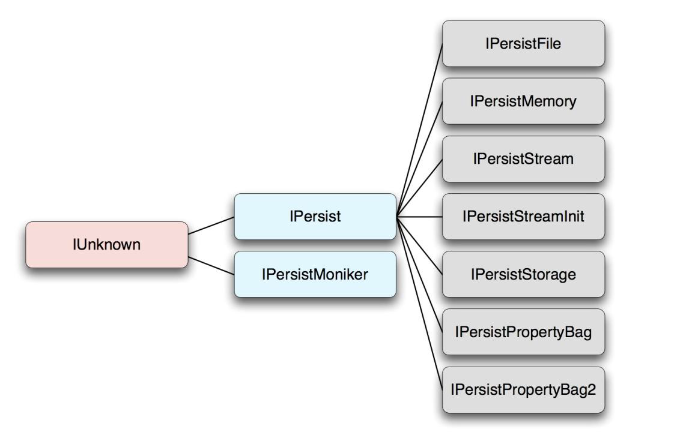</center>
<font color='#0000dd'><center>图15	持久化接口的继承结构</center></font>

#####在ATL中实现COM持久化

COM对象的开发人员可以自由地实现自己的持久化接口。如果这些开发人员选择为接口编写自己的代码，它们可以以任意格式读取和写入数据来操纵存储持久化数据的接口。但是，大多数开发人员选择使用Microsoft ATL中提供的模板类，通过利用模板代码可以避免实现这些接口所需的额外工作。 Microsoft ATL的第9版中就提供了以下持久化接口的模板类。

	.	IPersist 
	.	IPersistPropertyBag 
	.	IPersistStorage 
	.	IPersistStreamInit 
	
模板代码要求程序员定义一系列属性，即持久化接口可使用作为序列化和复活相关对象模板的属性映射。此属性映射是一个列出必须序列化和复活的控件的属性的结构数组。该数组应该足够明确，以保证对象一旦序列化，就等同于从数据中复活的对象。 ATL的第9版包括各种宏，以帮助程序员在定义这些属性使用。

	.	BEGIN_PROPERTY_MAP 
	.	BEGIN_PROP_MAP 
	.	PROP_ENTRY 
	.	PROP_ENTRY_EX 
	.	PROP_ENTRY_TYPE 
	.	PROP_ENTRY_TYPE_EX 
	.	PROP_PAGE 
	.	PROP_DATA_ENTRY 
	.	END_PROPERTY_MAP 
	.	END_PROP_MAP 
	
前面提到的每一个宏都是用各种参数，并利用他们定义ATL_PROPMAP_ENTRY结构体。下面的结构体定义来自ATL第9版。

```
struct ATL_PROPMAP_ENTRY
{
	LPCOLESTR szDesc;
	DISPID dispid;
	const CLSID* pclsidPropPage;
	const IID* piidDispatch;
	DWORD dwOffsetData;
	DWORD dwSizeData;
	VARTYPE vt;
};
```

ATL_PROPMAP_ENTRY结构体成员的理解十分重要，结构体成员的简要描述如表16所述：

|Element Name|Element Purpose|
|------------------|----------------------|
|szDesc|Unicode string that uniquely identifies the property name|
|dispid|32-bit integer that uniquely identifies the property within the object|
|pclsidPropPage|Pointer to a COM class id that identifies a COM class that offers a GUI interface to set and retrieve the property within the control.|
|piidDispatch|Pointer to a COM interface id that describes an interface that inherits from IDispatch, which can be used to set the property through the Invoke method of the interface|
|dwOffsetData|32-bit value that specifies the property's memory offset from the beginning of the object|
|dwSizeData|32-bit value that specifies the number of bytes that have been allocated in the object to hold the property's data|
|vt|16-bit value that specifies the property's type |
<font color='#0000dd'><center>表16	ATL_PROPMAP_ENTRY结构体成员和释义</center></font>

用于定义属性的宏函数使用提供给函数的参数来设置特定的ATL_PROPMAP_ENTRY成员，并将其他元素设置为默认状态。模板代码根据非默认值的成员来完成持久化数据序列化和恢复数据时的策略调整。 BEGIN_PROPERTY_MAP和BEGIN_PROP_MAP都包含开始定义结构的代码，但是前者将自动在属性映射中包含X和Y位置信息。 END_PROP_MAP和END_PROPERTY_MAP都是包括终止ATL_PROPMAP_ENTRY元素和结束结构定义的宏函数。BEGIN_PROPERTY_MAP，BEGIN_PROP_MAP，END_PROP_MAP，END_PROPERTY_MAP 都是ATL_PROPMAP_ENTRY的实例，它们描述了COM对象的属性。

PROP_ENTRY和PROP_ENTRY_EX都利用属性的名称，显示标识和可用于设置属性的属性页去对属性下定义。 PROP_ENTRY_TYPE和PROP_ENTRY_TYPE_EX及 PROP_ENTRY和PROP_ENTRY_EX的定义是一样的。但是它们需要在处理属性时显式地变换类型。 “_EX”后缀表示宏函数需要在设置或获取属性值时应使用的显式调度接口ID。 PROP_DATA_ENTRY宏需要该属性的唯一字符串标识符以用于存储该属性的类成员的名称，以及该属性所需的变体类型。在内部，PROP_DATA_ENTRY宏使用offsetof和sizeof结构在ATL_PROPMAP_ENTRY结构中显式定义dwOffsetData和dwSizeData。 PROP_PAGE用于指定提供GUI界面的COM类ID，该GUI界面可以操纵对象的属性。

为了帮助说明在C代码中使用属性映射以及如何从持久状态读取属性，我们将用一个名为HelloCom的COM对象作为简要示例。 HelloCom是一个简单的ActiveX控件，可以存储一个人的名字和姓氏。属性将具有以下名称：

	.	NameFirst 
	.	NameLast 
	
以下C++代码片段显示了HelloCom控件实现持久化相关的部分代码：

```
class HelloCom :
	public IPersistStreamInitImpl<HelloCom>,
	public IPersistStorageImpl<HelloCom>,
	public IPersistPropertyBagImpl<HelloCom>,
{
public:
BEGIN_PROP_MAP(HelloCom)
PROP_DATA_ENTRY("_cx", m_sizeExtent.cx, VT_UI4)
PROP_DATA_ENTRY("_cy", m_sizeExtent.cy, VT_UI4)
PROP_ENTRY("NameFirst", 1, CLSID_HelloComCtrl)
PROP_ENTRY_TYPE("NameLast", 2, CLSID_HelloComCtrl, VT_BSTR)
END_PROP_MAP()
};
```

如果应用程序从二进制流中加载持久化数据，那么应用程序将查询IPersistStreamInit接口并接收指向IPersistStreamInitImpl模板类的虚表。接下来，应用程序将调用Load（）方法，传入将用于读取持久化数据的IStream对象。程序会在序列化流中的所有数据之前首先确认存储版本号，以便于处理向后兼容性问题。因此，流中的前四个字节将是用于编译控件的ATL版本的小端存储。在Visual Studio 2008中，该值为0x00000900。只要该值小于或等于用于编译控件的ATL的版本，就可以恢复处理，否则将发出错误信号。

在处理版本控制信息之后，可以从流中检索属性本身。在这种情况下，流中版本号后面的字节将是_cx和_cy元素的两个4字节小端表示。由于这些元素是使用PROP_DATA_ENTRY宏声明的，因此这些32位值将直接写入m_sizeExtent.cx和m_sizeExtent.cy所在类的偏移位置。

通过这些值我们可以看到NameFirst的序列化表示。由于NameFirst是使用不包含数据类型的PROP_ENTRY（）宏在属性映射中声明的，因此需要从流中检索类型信息。因此，流中的前两个字节将是无符号的16位值0x0008，表示变体类型VT_BSTR。接下来将是一个无符号的32位值，该值用于指定字符串的长度。如果名称是“Example”，那么指定大小的这个32位整数的值将等于0x10;七个2字节字符加上一个终止空值。下一个值将是表示名称的字符，后跟终止的16位值0x0000。 然后是NameLast，除了流中不存在16位变体类型说明符外，声明方式与NameFirst相同，产生这种情况的原因是因为使用PROP_ENTRY_TYPE（）宏在属性映射中显式声明了类型。
表17显示了前面段落中描述的流的示例，其中十六进制值表示流中的值，偏移量表示流中值的位置，以及如何解释值的描述。

|Offset|Hexadecimal representation of bytes|Description|
|-------|------------------------------------------------|----------------|
|0x00|00 09 00 00|Version nine of the ATL|
|0x04|00 01 00 00|The \_cx value is 256|
|0x08|00 01 00 00|The _cy value is 256|
|0x0C|08 00|NameFirst is stored as a VT_BSTR|
|0x0E|0C 00 00 00|NameFirst is 12 characters long|
|0x12|46 00 69 00 72 00 73 00 74 00 00 00|NameFirst is equivalent to "First"|
|0x1E|0A 00 00 00|NameLast is 10 bytes long|
|0x22|4C 00 61 00 73 00 74 00 00 00|NameLast is equivalent to "Last"|

<font color='#0000dd'><center>表17	HelloCom示例流中包含的元素列表和释义</center></font>

#####Windows IE中的Com持久化
Microsoft Internet Explorer在为ActiveX对象的属性赋值时使用持久化。 Internet Explorer使用的六个主要接口（按优先顺序排列）是IPersistPropertyBag，IPersistMoniker，IPersistFile，IPersistStreamInit，IPersistStream和IPersistStorage。 浏览器将尝试按顺序检索到每个持久化接口的接口指针，直到成功，或者在没有找到接口时宣布操作失败。
第一个也是最熟悉的持久化接口是IPersistPropertyBag。 IPersistPropertyBag专门设计为允许将持久对象嵌入HTML中。 举例来说，以下HTML代码将Microsoft Media Player嵌入到网页中。

```html
<OBJECT id = "VIDEO" CLASSID = "CLSID:6BF52A52-394A-11d3-B153-00C04F79FAA6" >
	<PARAM NAME = "URL" VALUE = "MyVideo.wmv">
	<PARAM NAME = "enabled" VALUE = "True">
	<PARAM NAME = "AutoStart" VALUE = "False">
	<PARAM name = "PlayCount" value = "3">
	<PARAM name = "Volume" value = "50">
	<PARAM NAME = "balance" VALUE = "0">
	<PARAM NAME = "Rate" VALUE = "1.0">
	<PARAM NAME = "Mute" VALUE = "False">
	<PARAM NAME = "fullScreen" VALUE = "False">
	<PARAM name = "uiMode" value = "full">
< / OBJECT>
```

<OBJECT> 标签中包含<PARAM>标签表示COM对象的属性和持久化值。当Internet Explorer分析网页并遇到这些PARAM标签时，它首先创建一个PropertyBag类并查询IPropertyBag接口，然后解析PARAM 标签的名称和值参数，并在IPropertyBag接口上调用Write（）方法，提供其已解析的属性的值的名称和字符串表示形式。一旦Internet Explorer将所有PARAM标记加载到属性包中，就会查询IPersistPropertyBag接口的COM对象（即示例中的Media Player对象），然后调用IPersistPropertyBag接口的Load（）方法，传递从HTML解析的PropertyBag。然后，COM对象的Load（）方法将属性从字符串表示转换为对象的首选表示，并将转换后的表示保存在COM对象中。当遇到上述HTML时，Internet Explorer使用此策略从持久状态恢复对象。

当使用对象的innerHTML属性时，最常遇到对复活操作（序列化）的相互操作。请考虑以下在与上述HTML相同的网页中使用的JavaScript代码。

```
<script language = "JavaScript">
	alert(VIDEO.innerHTML);
< / script>
```

在使用这段代码时，网页会弹出消息框警告用户，内容与下表类似：

```
<PARAM NAME = "URL" VALUE = "./MyVideo.wmv">
<PARAM NAME = "rate" VALUE = "1">
<PARAM NAME = "balance" VALUE = "0">
<PARAM NAME = "currentPosition" VALUE = "0">
<PARAM NAME = "defaultFrame" VALUE = "">
<PARAM NAME = "playCount" VALUE = "3">
<PARAM NAME = "autoStart" VALUE = "0">
<PARAM NAME = "_cx" VALUE = "6482">
<PARAM NAME = "_cy" VALUE = "6350">
```

当Internet Explorer使用PropertyBag序列化对象时，会首先创建PropertyBag类的实例，然后查询要为IPersistPropertyBag接口保留的对象。 检索接口后，Internet Explorer将调用Save（）方法，并传递PropertyBag类实例，最后将PropertyBag类序列化为与HTML标准兼容的格式。

将持久化数据插入Internet Explorer控件的第二种不太常见的方法是使用OBJECT标记的data参数。 以下HTML中显示了这种持久化类型的示例。

```
<OBJECT
	id = "VIDEO"
	CLASSID = "CLSID:6BF52A52-394A-11d3-B153-00C04F79FAA6"
	data = "./persistence_data"
	type = "application/x-oleobject"
	/ >
```

在上面的示例中，不是使用PARAM标记，而是通过object标记的data参数传递持久化数据。当Internet Explorer遇到此格式的对象标记时，会遵循复杂的策略从序列化数据中恢复对象。

Internet Explorer将首先检查data参数中指定的文件名，以查看文件扩展名是否等于“.ica”，“.stm”或“.ods”。如果属于其中之一，则会创建一个从文件URL中读取二进制流的IStream。然后Internet Explorer会根据前16个字节指向的对象创建实例。如果这16个字节为零，则在对象标记中创建CLASSID参数并查询IPersistStream接口，成功检索到接口时，Internet Explorer将调用接口的Load（）方法，并传入IStream。接下来，COM对象将解析流并将二进制数据转换为每个属性的首选表示形式。完成这些操作后，Internet Explorer就得到了一个复活的COM对象。

如果文件名与其中一个已知的扩展名不匹配，Internet Explorer会做一些额外的工作来确定用于COM对象的持久化接口的类型和相应的持久化数据。首先，Internet Explorer将在COM对象中查询IPersistFile接口。如果成功检索到接口，它将调用COM对象接口的Load（）方法，并传入文件路径。然后COM对象负责打开文件并解析数据。

如果对象不支持IPersistFile接口，Internet Explorer将使用数据值中的URL创建一个IStream对象，然后在COM对象中查询IPersistStreamInit接口。如果此操作成功， Internet Explorer将调用IPersistStreamInit接口的Load（）方法，并传入IStream对象。如果COM对象不支持IPersistStreamInit接口，则会尝试在对象中查询IPersistStream接口。如果对象实现此接口，则Internet Explorer将调用IPersistStream接口的Load（）方法，并传入IStream对象。如果这些操作成功，则COM对象的IPersistStreamInit或IPersistStream接口负责从给定的持久化数据中恢复属性。

如果COM对象未实现IPersistStreamInit或IPersistStream，或者Load（）方法返回失败， Internet Explorer将尝试通过从OLE32调用StgOpenStorage将URL作为复合OLE文档加载。如果StgOpenStorage返回成功值，Internet Explorer将在COM对象中查询IPersistStorage接口。如果COM对象确实实现了IPersistStorage接口。

Internet Explorer将调用接口的Load（）方法，并传入IStorage对象。从这里开始，COM对象也有责任解析IStorage对象中包含的数据。

###攻击面

COM的攻击面可以拆解成三个领域，这些领域如下：

	.	浏览器对象公开的方法
	.	对象序列化
	.	Web浏览器组件之间的编组值
	
第一个攻击面实际上已经被多次提及了。事实上，有许多演讲主题集中定位于ActiveX控件以及各种自动模糊测试漏洞的工具和方法（对于感兴趣的读者，最近cert上公开了一篇由Will Dormann和Dan Plakosh编写的关于ActiveX模糊测试的论文，并提供了一个模糊测试工具，参考<http://www.cert.org/archive/pdf/dranzer.pdf>）。另一个流行的ActiveX fuzzer AxMan是由HD Moore发布的，见于<http://www.metasploit.com/users/hdm/tools/axman/>。

COM对象的序列化（也称为持久化）是另一个在安全问题上未被充分研究的领域。我们将在第3节中广泛地研究持久化的安全隐患，讨论反序列化问题，对象持久化导致的类型混淆漏洞，以及可以通过对象实例化破坏的信任边界。

最后，在第3节中，我们将在安全性的上下文中检查编组代码。由于它的隐含性质，很大程度上，这是另一个尚未开发的主要攻击面。由于通过API来以抽象方式跟踪内存分配，对象使用和类型转换的情况总是出现，编组代码可能非常难以编写。我们打算讨论在执行某种程度的编组时经常出现的问题类型，流行的API和接口，以及在编组代码中比其他类型代码更常见的问题的类型。

##NPAPI插件

Netscape插件应用程序编程接口（NPAPI）是当下许多Web浏览器采用的首选插件架构，包括Mozilla Firefox，Google Chrome，Apple Safari和Opera。该体系结构提供了一个简单的模型，用于创建插件，通过定义的API调用向Web浏览器公开功能。尽管NPAPI在其原始版本中有所限制，但随着时间的推移，插件的策略得以修改，现在它们不仅可以处理嵌入在网页中的专用对象，还可以使用托管脚本语言（如JavaScript）将它们暴露给脚本控件。这主要是由于2004年几家公司（Mozilla，Apple，Macromedia，Opera和Sun）的共同努力，通过添加所谓的NPRuntime来扩展NPAPI，NPRuntime提供了一个跨平台标准，用于向浏览器公开对象DOM。本节旨在提供有关如何利用NPAPI的技术细节，特别是NPRuntime组件。

###插件注册

在深入研究NPAPI的细节之前，我们将简要探讨插件注册到浏览器的过程。 这些内容是列举给定安装的攻击面所必须的。

插件是最简单的共享库，它们在浏览器中注册，并分别处理专门的对象类型。 注册时，插件处理的对象以MIME类型，文件扩展名或两者的组合形式指定。 插件的注册方式以及与MIME类型/扩展相关联的方式因浏览器和平台而异。 本节主要参考Mozilla Firefox的Windows安装，但在其他环境中可以使用类似的过程。

插件以两种方式之一注册到Firefox浏览器：

1.	将插件复制到浏览器Plugins目录中（通常是C：\ Program Files \ Mozilla Firefox \ plugins）
2.	注册表中添加相应键值，以指示插件位置和其他细节（在HKEY_LOCAL_MACHINE \ Software \ MozillaPlugins或HKEY_CURRENT_USER \ Software \ MozillaPlugins中，插件所需的各个子项的结构在 <https://developer.mozilla.org/en/Plugins/The_First_Install_Problem>中）


有关给定插件的关联MIME类型和文件扩展名的信息位于已编译DLL中的版本信息中。 MIME类型在一系列管道分隔（'|'）MIME标识符中指定，如下所示：

`MIMEType: mime / type - 1 | mime / type - 2 | mime / type - 3`

类似的，文件扩展名也用管道符分割，如下所示：

`FileExtents: ext1 | ext2 | ext3`

检查firefox安装的特定插件的方法：浏览器url中键入about:plugins 然后即可显示插件列表和每个插件的MIME类型和扩展名。
<center>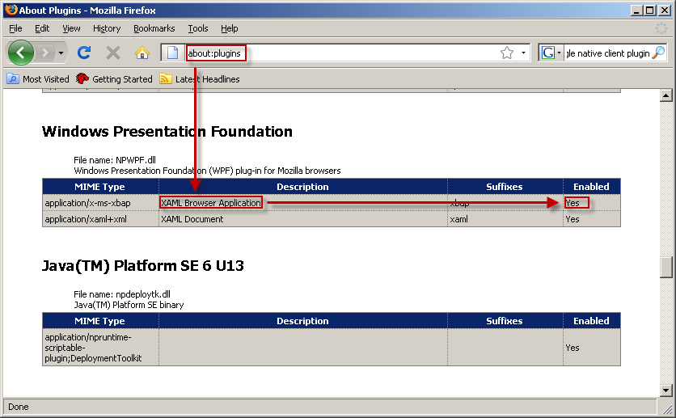</center>
<font color='#0000dd'><center>图18	插件和扩展程序列表图</center></font>


###NPAPI和插件初始化

NPAPI大致分为两组函数：浏览器端函数和插件端函数。浏览器端函数表示浏览器到处到插件的API。这些API被定义在NPNetscapeFuncs结构体中，这个结构体定义在NPAPI SDK的npupp.h中定义（作为Gecko SDK的一部分：https：//developer.mozilla.org/En/Gecko_SDK）显示如下：

```c
typedef struct _NPNetscapeFuncs {
	uint16 size;
	uint16 version;
	NPN_GetURLUPP geturl;
	NPN_PostURLUPP posturl;
	NPN_RequestReadUPP requestread;
	NPN_NewStreamUPP newstream;
	NPN_WriteUPP write;
	NPN_DestroyStreamUPP destroystream;
	NPN_StatusUPP status;
	NPN_UserAgentUPP uagent;
	NPN_MemAllocUPP memalloc;
	NPN_MemFreeUPP memfree;
	NPN_MemFlushUPP memflush;
	NPN_ReloadPluginsUPP reloadplugins;
	NPN_GetJavaEnvUPP getJavaEnv;
	NPN_GetJavaPeerUPP getJavaPeer;
	NPN_GetURLNotifyUPP geturlnotify;
	NPN_PostURLNotifyUPP posturlnotify;
	NPN_GetValueUPP getvalue;
	NPN_SetValueUPP setvalue;
	NPN_InvalidateRectUPP invalidaterect;
	NPN_InvalidateRegionUPP invalidateregion;
	NPN_ForceRedrawUPP forceredraw;
	NPN_GetStringIdentifierUPP getstringidentifier;
	NPN_GetStringIdentifiersUPP getstringidentifiers;
	NPN_GetIntIdentifierUPP getintidentifier;
	NPN_IdentifierIsStringUPP identifierisstring;
	NPN_UTF8FromIdentifierUPP utf8fromidentifier;
	NPN_IntFromIdentifierUPP intfromidentifier;
	NPN_CreateObjectUPP createobject;
	NPN_RetainObjectUPP retainobject;
	NPN_ReleaseObjectUPP releaseobject;
	NPN_InvokeUPP invoke;
	NPN_InvokeDefaultUPP invokeDefault;
	NPN_EvaluateUPP evaluate;
	NPN_GetPropertyUPP getproperty;
	NPN_SetPropertyUPP setproperty;
	NPN_RemovePropertyUPP removeproperty;
	NPN_HasPropertyUPP hasproperty;
	NPN_HasMethodUPP hasmethod;
	NPN_ReleaseVariantValueUPP releasevariantvalue;
	NPN_SetExceptionUPP setexception;
	NPN_PushPopupsEnabledStateUPP pushpopupsenabledstate;
	NPN_PopPopupsEnabledStateUPP poppopupsenabledstate;
} NPNetscapeFuncs;
```

当插件最初加载到内存中时，它会调用NP_Initialize（）函数进行初始化，该函数需要插件才能导出。 NPNetscapeFuncs结构作为浏览器的第一个参数传递给此函数，从而将其API暴露给插件。 读者应注意，尺寸和版本元素中存在的信息允许对API进行扩展，而API实际上已经投入使用。 SDK鼓励使用前缀NPN_ \*作为浏览器端函数的命名方法（“Netscape Plugin：Navigator”），因此本文的其余部分将引用使用该约定的回调。

插件端函数是插件实现的函数，共同用于定义插件的功能。 插件端函数包含在NPPluginFuncs结构中，该结构也在npupp.h中定义，具体定义如下：

```
typedef struct _NPPluginFuncs {
	uint16 size;
	uint16 version;
	NPP_NewUPP newp;
	NPP_DestroyUPP destroy;
	NPP_SetWindowUPP setwindow;
	NPP_NewStreamUPP newstream;
	NPP_DestroyStreamUPP destroystream;
	NPP_StreamAsFileUPP asfile;
	NPP_WriteReadyUPP writeready;
	NPP_WriteUPP write;
	NPP_PrintUPP print;
	NPP_HandleEventUPP event;
	NPP_URLNotifyUPP urlnotify;
	JRIGlobalRef javaClass;
	NPP_GetValueUPP getvalue;
	NPP_SetValueUPP setvalue;
} NPPluginFuncs; 
```

插件需要暴露NP_GetEntryPoints（）函数，该函数使用NPPluginFuncs结构在插件初始化时将插件信息传递给浏览器。浏览器调用NP_GetEntryPoints，将指针传递给可以保存NPPluginFuncs结构体的内存中。反过来，NP_GetEntryPoints使用插件的信息填充结构。按照惯例，插件函数名称以NPP_ \*（Netscape Plugin：Plugin）作为前缀，我们将在本文中尝试遵循此约定。

###插件初始化和销毁

NPAPI插件有两个初始化级别——我们已经看到了，第一个是浏览器加载插件时执行的一次性初始化。如前所述加载是通过调用导出函数NP_Initialize（）来实现的。另一个是实例初始化，每次实例化插件时都会发生。例如，如果在同一页面上的两个不同<OBJECT>标签中使用相同的插件，则将执行一次性加载初始化，然后进行两次实例初始化。 实例初始化由插件的NPP_New（）函数执行，其定义如下：

`NPError NPP_New(NPMIMEType pluginType, NPP instance, uint16 mode, int16 argc,char *argn[], char *argv[], NPSavedData *saved);`

这个函数有很多参数可以为插件提供实例信息以帮助完成初始化过程。 pluginType参数表示与此插件实例关联的MIME类型。许多插件注册了多个MIME类型，因此该参数允许每个实例区分它应该处理的MIME类型。第二个参数instance是一个指向插件对象实例的指针，该插件对象有一个pdata成员，该插件可以用来保存特定于当前插件实例的任何私有数据。插件通常用于在此处保存C ++对象。下一个参数是mode参数，它可以取值NP_EMBED（1）表示对象嵌入在网页中，如果插件表示整页对象，则取NP_FULL（2）。接下来的三个参数与提供给对象的<PARAM>值（当使用<EMBED>标签时表示<EMBED>标签中的属性）相关。 argc参数表示argn和argv数组中提供的参数数量。两个字符串数组argn和argv的元素计数等于argc参数，并分别指定参数名称和值。最后，保存的参数可用于访问使用我们接下来要探索的函数：NPP_Destroy（）的插件的先前实例保存的数据。

NPP_Destroy()函数是用来进行销毁的，它的定义如下：

`NPError NPP_Destroy(NPP instance, NPSavedData **saved); `

该函数只需要一个实例化指针和一个NPSavedData \*\*，它可以用来保存下一个插件实例的信息，如前所述。

###流

流和典型的NPAPI插件的攻击面也有很密切的关系。由NPStream数据结构表示的流对象表示从浏览器发送到插件的不透明数据流，反之亦然。 插件实例可以处理多个流，但每个流特定于该插件实例，它们彼此之前无法共享。

通过调用插件端函数NPP_NewStream（）可以将新流从浏览器发送到插件，该函数具有以下原型。

`NPError NPP_NewStream(NPP instance, NPMIMEType type, NPStream \*stream, NPBool seekable, uint16 \*stype);`

除了stype参数之外，这些参数中的大多数都是不言自明的，插件填充为以下值之一：

	.	NP_NORMAL (1) – 流数据在拉取时传输，是默认操作模式
	.	NP_ASFILEONLY (2) –数据首先保存在本地临时文件中
	.	NP_ASFILE (3) – 数据与NP_NORMAL模式一样正常传输，但是也保存到临时文件中
	.	NP_SEEK (4) – 流数据可以随机访问

当文件与插件实例关联（例如Adobe Flash插件的SWF文件），或当插件通过调用NPN_GetURL（），NPN_GetURLNotify（），NPN_PostURL（）请求流时，流将传递到插件， 或NPN_PostURLNotify（）函数中。稍后通过调用NPP_DestroyStream（）函数来销毁流。 该函数具有以下原型：

`NPError NPP_DestroyStream(NPP instance, NPStream \*stream, NPReason reason);`

流数据的处理发生NPP_Write（）或NPP_AsFile（）中，具体取决于相关流是分别是NP_NORMAL / NP_ASFILE还是NP_ASFILEONLY流。 使用流数据的机制超出了本文的范围，将不再进一步讨论。

###NPRuntime基础知识

NPRuntime是NPAPI的补充，它提供了一个统一的接口，允许插件将可编写脚本的对象暴露给DOM。 在引入NPRuntime之前，还有其他方法允许插件暴露给Java和脚本桥 -  LiveConnect和XPCOM。 这两种技术虽然仍在某种程度上得到支持，但普遍认为已经弃用，超出了本文的范围。
提供脚本功能的插件可以通过NPP_GetValue（）函数来实现。 实质上，浏览器使用此函数来查询插件以获取许多众所周知的属性。 它有以下原型：

`NPError NPP_GetValue(NPP instance, NPPVariable variable, void \*ret_value); `

Variable参数值得是从插件中检索的类的信息，比如插件名称，描述或者实例化窗口句柄等信息。引入PNRuntime组件时会将一个变量添加到可查询的可能变量的枚举——NPPVpluginScriptableNPObject中，它的数值是15。当查询这个数值时，插件可以选择翻译到封装插件脚本功能的NPObject指针中。（该对象稍后讨论）这是通过在ret_value参数中放置指向NPObject的指针来实现的。当NPPVpluginScriptableNPObject发生查询时，ret_value参数实际上被解释为NPObject \*\*。在调用NPP_GetValue（）并将变量参数设置为NPPVpluginScriptableNPObject时，没有任何脚本功能的插件只会返回错误。

####可脚本化对象

前面提到过，对象是由NPObject结构体公开的，该结构体定义在npruntime.h中，定义如下：

```
struct NPObject {
	NPClass *_class;
	uint32_t referenceCount;
	/*
	* Additional space may be allocated here by types of NPObjects
	*/
};
```

这个功能实际上是由封装的NPClass对象实现的，该对象也在npruntime.h中定义，如下所示：

```
struct NPClass
{
	uint32_t structVersion;
	NPAllocateFunctionPtr allocate;
	NPDeallocateFunctionPtr deallocate;
	NPInvalidateFunctionPtr invalidate;
	NPHasMethodFunctionPtr hasMethod;
	NPInvokeFunctionPtr invoke;
	NPInvokeDefaultFunctionPtr invokeDefault;
	NPHasPropertyFunctionPtr hasProperty;
	NPGetPropertyFunctionPtr getProperty;
	NPSetPropertyFunctionPtr setProperty;
	NPRemovePropertyFunctionPtr removeProperty;
	NPEnumerationFunctionPtr enumerate;
	NPConstructFunctionPtr construct;
};
```

对象中封装的每一个函数都实现了javascript操作的重要功能，关于API的部分将在下面讨论。

####对象初始化和销毁

首先看一下对象初始化。通常都是通过定义具有所有相关函数的NPClass结构，然后调用浏览器端函数NPN_CreateObject（）的方法来创建可编写脚本的对象。 该函数具有以下原型：

`NPObject \*NPN_CreateObject(NPP npp, NPClass *aClass)`

可以看出，NPN_CreateObject（）将实例指针作为其第一个参数（稍后我们将探讨），并将指向NPClass结构的指针作为其第二个参数。 函数的功能是在NPClass对象周围创建一个NPObject包装器并返回它。 如果NPClass对象定义了allocate（）回调，那么将调用它来为NPN_CreateObject（）函数返回的NPObject结构分配内存。 此分配回调功能允许开发人员分配额外的空间来保存包含NPObject的结构中有关对象的任何特定于上下文的信息。 标准技术是将对象表示为C ++类，如下所示：

```
// MyObject derives from NPObject – 
// It will be exposed as a scriptable object 
class MyObject : public NPObject
{
public:
	// Definition of the objects behaviors 
	static NPClass myObjectClass =
	{
	NP_CLASS_STRUCT_VERSION,
	Allocate,
	Deallocate,
	Invalidate,
	HasMethod,
	Invoke,
	InvokeDefault,
	HasProperty,
	GetProperty,
	SetProperty,
	};
	// Call this function from NPP_GetValue() to retrieve the 
	// scriptable object 
	// It will create an NPObject wrapping the myObjectClass NPClass 
	// It will also call Allocate() to allocate the NPObject 
	static MyObject *Create(NPP npp)
	{
		MyObject *object;
		object = reinterpret_cast<MyObject *>
			(NPN_CreateObject(npp, &myObjectClass));
	}
	// The Allocate() function creates an instance of MyObject, 
	// so we can initialize any private variables for MyObject etc.. 
	// Note that the Allocate() function needs to be static 
	static NPObject *Allocate(NPP npp, NPClass *class)
	{
		return new MyObject(npp);
	}
	..other methods ..
};
```

创建对象的另一个值得注意的细节是NPObject结构的引用计数成员将初始化为1，并且每次将对象传递给浏览器端函数NPN_RetainObject（）时，计数值都会递增，其定义如下：

`NPObject \*NPN_RetainObject(NPObject\*obj);`

这个函数可以被看做为Microsoft COM对象的AddRef（）的模拟。

当不再需要一个对象时，可调用NPN_ReleaseObject()来完成对象释放，它是NPN_CreateObject()的互易函数。调用时引用计数变量递减，当计数值减为0时取消分配对象。如果正在释放的NPObject指向的NPClass结构包含deallocate（）回调，则将用于销毁该对象。 否则，默认系统分配器将释放内存。

####对象行为

对象最重要的特征是它暴露的行为。 对象可以公开两种不同类型的属性：属性和方法。 已定义属性是可以设置或检索的对象属性，它在脚本中被操纵，就像你期望任何其他DOM对象的属性一样：

```
Plugin.property = setVal; // set the property 
retVal = Plugin.property; // retrieve the property 
delete Plugin.property; // remove the property
```

在内部，脚本执行任何操作时都会从NPClass对象调用四个属性相关函数中的两个。

```
bool HasProperty(NPObject *obj, NPIdentifer name)
bool GetProperty(NPObject *obj, NPIdentifier name, NPVariant *result)
bool SetProperty(NPObject *obj, NPIdentifier name, NPVariant *value)
bool RemoveProperty(NPObject *obj, NPIdentifier name)
```

无论是设置还是检索属性，浏览器采取的第一个操作是检查该属性是否支持，这是通过调用HasProperty（）方法通过属性名称来完成检查的。 NPIdentifier数据类型用于解析属性或方法，包含的是名称的哈希而不是值。如果不支持请求的名称，则会向脚本运行时返回错误。假设HasProperty（）成功，则调用GetProperty（）或SetProperty（），具体取决于是检索还是设置。在检索的情况下，指向属性值的指针放在GetProperty（）的result参数中，该参数将被脚本运行时解释为返回值（前一个脚本示例中的retVal）。在设置属性时，value参数将被解释为属性设置的值（上一个脚本示例中的setVal）。最后，可以使用上面提到的删除语法删除属性，但删除功能很少被使用。值得注意的是，第一个参数obj是指向对象本身的指针。设置和获取属性的过程如图19所示。

<center>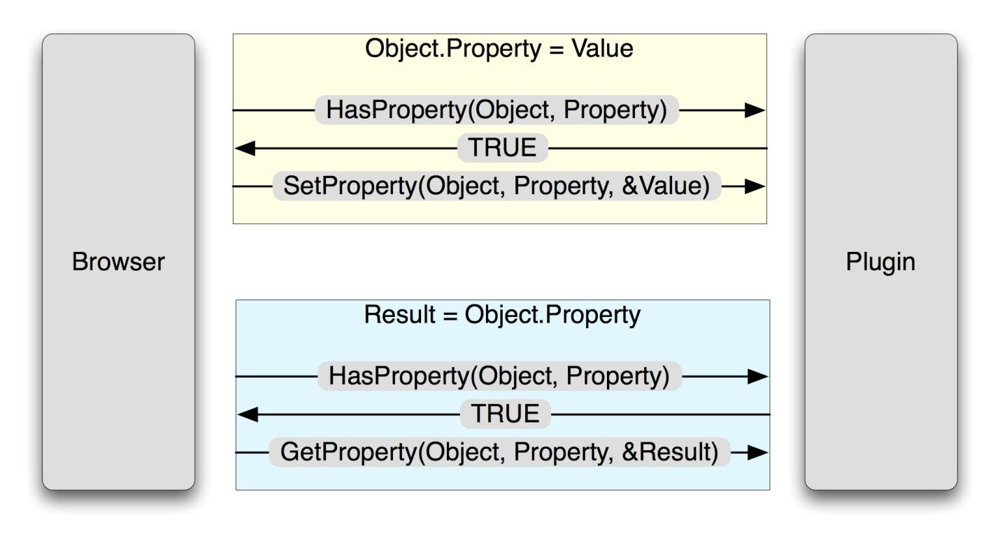</center>
<font color='#0000dd'><center>图19	获取设置NPObject属性</center></font>

和属性操作类似的方式类似，NPClass结构体中定义了三个方法，具体方法如下：

```
bool HasMethod(NPObject *obj, NPIdentifier name)
bool Invoke(NPObject *obj, NPIdentifier name, const NPVariant *args, uint32_t argCount, NPVariant *result)
bool InvokeDefault(NPObject *obj, const NPVariant *args, uint32_t argCount,
	NPVariant *result)
	
```
与属性一样，当调用方法时，浏览器首先调用HasMethod（）以查看插件是否已定义给定方法。 如果调用成功返回，则调用Invoke（）函数。 Invoke（）函数接受在name参数中调用的方法名称，然后是一个参数数组和一个指示参数数组大小的计数，最后，一个指向调用结果的指针将会被写入Variant型的指针中。 当插件对象被执行时，则会像一个方法一样使用InvokeDefault（）函数，如下面的JavaScript代码片段所示：

```
var pluginobj = document.getElementById(“plugin”);
var result = pluginobj(args); 
```

####参数传递

正如我们上一节看到的，对象可以根据脚本主机可用的属性和方法来定义行为。 在这两种情况下，都会以 NPVariants作为参数传入和传出NPAPI入口点。 NPVariants基本上是一个不透明的数据结构，它表示可以从脚本引擎（如JavaScript）轻松导入或导出的不同变量。 NPVariant结构定义如下：

```
typedef struct _NPVariant {
	NPVariantType type;
	union {
		bool boolValue;
		int32_t intValue;
		double doubleValue;
		NPString stringValue;
		NPObject *objectValue;
	} value;
} NPVariant; 
```

可以看出，该结构是一种非常简单的类/联合结构，类似于Microsoft Windows平台上普遍存在的VARIANT数据结构。 这里的所有数据类型都是基本类型或NPObject（之前讨论过），但有一个例外 -  NPString值，定义如下：

```
typedef char NPUTF8;
typedef struct _NPString {
	const NPUTF8 *utf8characters;
	uint32_t utf8length;
} NPString; 
```

联合中的值定义为NPVariant类型，定义类型如下：

```
typedef enum {
	NPVariantType_Void,
	NPVariantType_Null,
	NPVariantType_Bool,
	NPVariantType_Int32,
	NPVariantType_Double,
	NPVariantType_String,
	NPVariantType_Object
} NPVariantType;
```
 
NPAPI提供了许多用于操纵NPVariant数据结构的标准化宏。 这些宏在npruntime.h中定义，分为三类：第一个类别用于测试NPVariant的类型，其格式为：NPVARIANT_IS_XXX（），其中XXX是要检查的对象类型：

```
#define NPVARIANT_IS_VOID(_v) ((_v).type == NPVariantType_Void) 
#define NPVARIANT_IS_NULL(_v) ((_v).type == NPVariantType_Null) 
#define NPVARIANT_IS_BOOLEAN(_v) ((_v).type == NPVariantType_Bool) 
#define NPVARIANT_IS_INT32(_v) ((_v).type == NPVariantType_Int32) 
#define NPVARIANT_IS_DOUBLE(_v) ((_v).type == NPVariantType_Double) 
#define NPVARIANT_IS_STRING(_v) ((_v).type == NPVariantType_String) 
#define NPVARIANT_IS_OBJECT(_v) ((_v).type == NPVariantType_Object)  
```
例如，可以使用NPVARIANT_IS_STRING()宏测试给定Variant是否是字符串。第二类是从NPVariant中提取值，宏名称的形式为NPVARIANT_TO_XXX()：

```
#define NPVARIANT_TO_BOOLEAN(_v) ((_v).value.boolValue) 
#define NPVARIANT_TO_INT32(_v) ((_v).value.intValue) 
#define NPVARIANT_TO_DOUBLE(_v) ((_v).value.doubleValue) 
#define NPVARIANT_TO_STRING(_v) ((_v).value.stringValue) 
#define NPVARIANT_TO_OBJECT(_v) ((_v).value.objectValue)  
```


有一些宏用于将数据存储到NPVariant变量中。 这些宏的格式为XXX_TO_NPVARIANT()。 最后一个类别主要用于为GetProperty（），Invoke（）和InvokeDefault（）函数填充结果NPVariant。

####编组和类型解析

那么，脚本主机如何将数据传入插件，从插件传递数据？ 答案是需要一个编组层来解释脚本主机中的对象并将它们转换为插件理解的类型，反之亦然。 显然，这个层是依赖于实现的，并且因浏览器而异。 本节将简要概述Mozilla Firefox编组层，以便于JavaScript和可编写脚本的对象之间的通信。

NPRuntime插件所需的转换实际上非常简单，因为在大多数情况下，NPObject类型精确映射到本机支持的JavaScript。 编组操作都包含在Firefox源代码树的单个文件mozilla / modules / plugin / base / src / nsJSNPRuntime.cpp中。 为了实现将JavaScript变量转换为NPVariants的（反之亦然）两个主要目标，需要采用对象代理方法，下面进行讨论。

在设置属性或调用方法时，传递给插件的JavaScript对象需要转换为NPVariants。 对于基本类型，此转换是将JavaScript中的文字值移植到NPVariant结构中的简单过程。

```
if (JSVAL_IS_PRIMITIVE(val)) {
	if (val == JSVAL_VOID) {
		VOID_TO_NPVARIANT(*variant);
	}
	else if (JSVAL_IS_NULL(val)) {
		NULL_TO_NPVARIANT(*variant);
	}
	else if (JSVAL_IS_BOOLEAN(val)) {
		BOOLEAN_TO_NPVARIANT(JSVAL_TO_BOOLEAN(val), *variant);
	}
	else if (JSVAL_IS_INT(val)) {
		INT32_TO_NPVARIANT(JSVAL_TO_INT(val), *variant);
	}
	else if (JSVAL_IS_DOUBLE(val)) {
		DOUBLE_TO_NPVARIANT(*JSVAL_TO_DOUBLE(val), *variant);
		```

处理此转换的代码位于JSValToNPVariant（）中。 在字符串的情况下，需要做一些额外的工作来处理UTF-8转换。

```
}
	else if (JSVAL_IS_STRING(val)) {
		JSString *jsstr = JSVAL_TO_STRING(val);
		nsDependentString str((PRUnichar *)::JS_GetStringChars(jsstr),
			::JS_GetStringLength(jsstr));
		PRUint32 len;
		char *p = ToNewUTF8String(str, &len);
		if (!p) {
			return false;
		}
		STRINGN_TO_NPVARIANT(p, len, *variant);
		
		```
		
最后，还有JavaScript对象。 当这些作为参数传递时，会创建一个包装JavaScript对象的NPObject结构。 包装器对象的功能在NPClass结构sJSObjWrapperClass中定义，该结构包含将请求代理到JavaScript引擎的方法。 例如，如果在包装器对象上调用NPP_GetProperty（），它将检索被包装的JavaScript对象的实例，并允许JavaScript引擎在内部处理特定内容。 该过程如图20所示。

<center>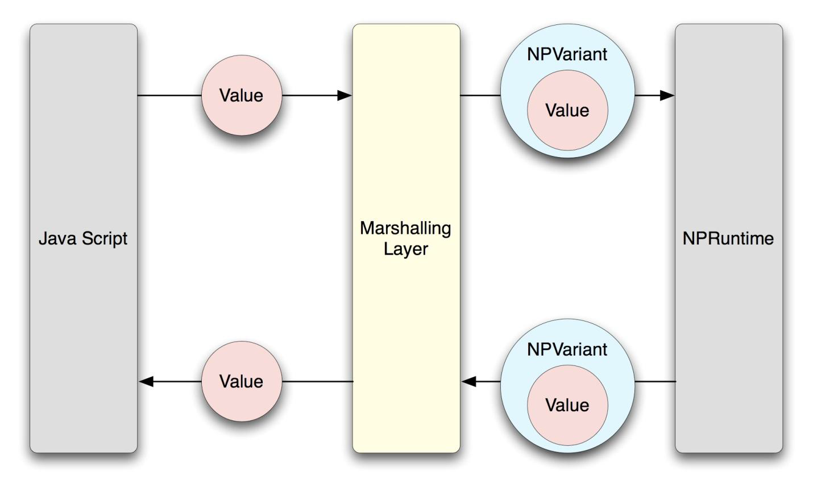</center>
<font color='#0000dd'><center>图20	传递NPRuntime前由编组层疯转个的JS对象</center></font>

类似地，当对象从NPVariants转换回JavaScript时，NPVariantToJSVal（）函数会将立即值复制回JavaScript对象，或者创建一个代理调用NPObject公开的功能的JavaScript对象。 此代理类使用sNPObjectJSWrapperClass结构实现。

###攻击面

在NPAPI的背景下，攻击面大致可以细分为三个领域：

	.	插件标准入口
	.	暴露给可脚本化对象的入口
	.	浏览器自身的编组层
	
标准插件入口点可以概括为由“Netscape插件”结构公开的那些（即NPP_ \*函数）。我们检查了标准入口点中相对较大的攻击面，特别是通过NPP_New（）向插件实例提供参数，或者在URL流中检索数据的攻击面（当收到NP_NORMAL流时，这些数据主要由NPP_Write（）以及收到NP_ASFILEONLY流时的NPP_StreamAsFile（）函数处理）。虽然这个攻击面有一些大，但是这些攻击面在此前的安全研究中得到较明确的关注。因此本文将不会再这个方向上有更多讨论。
可脚本化对象暴露的入口点可能是此前没有得到重点关注的巨大攻击面，实现对象的脚本交互的函数是最明显的攻击向量（例如：给定NPObject的Invoke（），InvokeDefault（）,GetProperty（）和SetProperty（））。我们还必须在此攻击面中考虑不太明显的互操作性入口点 - 主要是插件使用NPN_GetProperty（）函数访问DOM层次结构的位置。

最后，每个实现NPAPI运行时的浏览器都必须提供一些用于将对象从脚本语言运行时转换为NPVariants（反之亦然）的编组层。这一层给攻击者提供了大量可以完成漏洞发现的机会。

#第三节	针对互操作性的攻击
---

实现互操作性的架构很难实现。开发代码是必须避免一系列的新问题，这些问题的出现可以给攻击者带来破坏系统安全性的新机会。以下内容将列举在通过互操作性层管理数据时出现的漏洞类型。具体类型如下：

1.	对象保留漏洞(##互操作性攻击I：对象保留漏洞）
2.	类型混淆漏洞
3.	传递信任漏洞

本文中类型混淆和传递信任类漏洞的研究明显扩展了相关领域此前的研究和使用——在一定程度上，它们可以被认为是新的漏洞类型。当然，在数据编组的上下文中也存在标准类型的漏洞，例如整数宽度问题和缓冲区溢出，但本文不会讨论这些漏洞，因为它们已被很好地理解，并且已有大量资料充分阐明了这些漏洞。

##互操作性攻击I：对象保留漏洞

在内聚模块之间传递的数据可以是简单的值（例如整数或布尔值），也可以是复杂的数据结构（例如COM对象）。对于后一种情况，运行时必须有一个方法来管理对象的生命周期。管理对象生命周期的一般策略是使用引用计数原语。这样的策略的目的是：在对象的消费者需要和完成处理对象时由消费者自身发出信号。那么，如果消费者无法正确报告对象使用情况，就会存在潜在的内存管理漏洞。一般来说，对象生命周期的错误管理发生在两种情况下：

1.	需要时没有保留对对象的引用，存在过早释放内存的风险
2. 	在需要时没有释放对对象的引用，存在内存泄漏以及潜在的可利用场景

本节将描述这两种代码结构在两种真实插件体系结构中产生的机制。读者应该注意，本节中易受攻击的代码构造很可能在插件对象和编组层本身中找到，因为这些接口通常需要在强制处理进程期间执行转换时保留对对象的引用并生成新对象。

###Mircosoft对象保留漏洞

Microsoft插件体系结构广泛使用COM对象和VARIANT来定义和传递浏览器中各个组件之间的对象。实际上，JavaScript对象在语言运行时被表示为COM对象，而VBScript对象表示为VARIANT。访问ActiveX对象公开的方法或属性是通过调用对象的IDispatch :: Invoke（）方法来完成的，该方法将参数作为VARIANT数组传递到目标函数。 （请注意，对于ActiveX控件来说，属性实际上是作为一对方法调用公开的，其名称格式为get_XXX（）和put_XXX（），其中XXX是属性的名称。这两个函数分别检索和设置属性。）而包含在VARIANT中的对象实际上可以是任何类型和值，但最常见的是基本类型（如整数或字符串）或者代表复杂对象的COM接口。由于JavaScript在内部将对象表示为IDispatch（或更准确地说，IDispatchEx）COM接口，因此VT_DISPATCH VARIANT将是在浏览器上下文中传递给特定控件的最常见的基于COM的VARIANT。

COM对象保持内部引用计数，并由IUnknown :: AddRef（）和IUnknown :: Release（）方法在外部进行操作，这些方法分别递增和递减引用计数。一旦引用计数达到0，对象将从内存中删除自身。 ActiveX控件中的对象保留错误是对象引用计数错误管理的结果。本节将对开发人员在处理生命周期大于单个函数调用范围的对象时容易犯的典型错误进行讨论。
####ActiveX对象保留攻击I：没有保留

控件在对象保留的问题上可能出现的最明显的错误是没有添加它想要保留的COM对象的引用计数。 当ActiveX函数将COM对象作为参数时，编组层已经在接收到的对象上调用了IUnknown :: AddRef（），以确保它不会被竞争线程删除。 但是，编组器也会在插件函数返回后释放接口。 因此，那些希望保留超出方法范围的COM对象实例的插件对象必须在方法返回之前调用IUnknown :: AddRef（）函数。当然调用IUnknown :: QueryInterface（）也可以，因为这个函数也会（或者至少应该）为对象调用IUnknown :: AddRef（）。 当这些函数没有被调用时，就可能导致潜在的过时指针漏洞（UAF）。 关于这个问题，给出一个示例代码，如下所示：

```
HRESULT CMyObject::put_MyProperty(IDispatch *pCallback)
{
	m_pCallback = pCallback;
	return S_OK;
}
HRESULT CMyObject::get_MyProperty(IDispatch **out)
{
	if (out == NULL || *out == NULL || m_pCallback == NULL)
		return E_INVALIDARG;
	*out = m_pCallback;
	return S_OK;
}
```

此代码中的put_MyProperty（）函数存储一个IDispatch指针，这个指针可以在后续使用get_MyProperty（）函数由客户端应用程序去检索。但是，由于没有使用AddRef（），所以无法保证在客户端回读属性时pCallback函数仍然存在。如果删除了对该对象的任意其他引用，则将取消分配该对象，使m_pCallback指向非法的内存。
#####VARIANT浅拷贝
复制VARIANT对象，通常使用VariantCopy（）完成。但在许多情况下开发人员只使用简单的memcpy（）。 VariantCopy（）是首选方法，因为它将执行对象感知复制 - 如果要复制的VARIANT是字符串，它将复制内存。如果要复制的对象是对象，则会添加引用计数。相比之下，memcpy（）显然执行浅拷贝 - 如果VARIANT包含任何类型的复杂对象，例如IDispatch，则会在不添加对象附加引用的情况下复制和使用对象的指针。如果保留此重复VARIANT的结果，那么在该对象任何实例被释放时，对象的指针都会被删除。以下代码演示了这个易受攻击的构造。

```
HRESULT CMyObject::put_MyProperty(VARIANT src)
{
	HRESULT hr;
	memcpy((void *)&m_MyProperty, (void *)&src, sizeof(VARIANT));
	return S_OK;
}
HRESULT CMyObject::get_MyProperty(VARIANT *out)
{
	HRESULT hr;
	if (out == NULL)
		return E_FAIL;
	VariantInit(out);
	memcpy(out, (void *)&m_MyProperty, sizeof(VARIANT));
	return S_OK;
}
```

攻击还可以产生微妙的变化——VariantCopy（）。从某种角度来说，VariantCopy（）也可以被认为是浅拷贝操作，因为任何具有VT_BYREF修饰符的VARIANT都不会被深度复制; 只是指针将被复制。详情见以下代码：

```
HRESULT CMyObject::put_MyProperty(VARIANT src)
{
	HRESULT hr;
	VariantInit(&m_MyProperty);
	hr = VariantCopy(&m_MyProperty, &src);
	if (FAILED(hr))
		return hr;
	return S_OK;
}
HRESULT CMyObject::get_MyProperty(VARIANT *out)
{
	HRESULT hr;
	if (out == NULL)
		return E_FAIL;
	VariantInit(out);
	hr = VariantCopy(out, &m_MyProperty);
	if (FAILED(hr))
		return hr;
	return S_OK;
}
```

这个示例展示了一个ActiveX的示例属性，它只是接收了VARIANT，将其存储，并可选择地返回给用户。这个代码的问题在于开发者使用了VariantCopy（）而不是VariantCopyInd（）。如果一个VARIANT支持类型VT_BYREF | VT_DISPATCH，则可以进行简单的指针复制。当指向VT_DISPATCH对象被删除时，则会留下指向不再存在的IDispatch对象的VARIANT型指针。 如果随后尝试获取此属性，则用户将检索带有过时指针的VARIANT，从而导致内存损坏。
#####ActiveX编组器
为了确切地了解对象作为参数传递给ActiveX控件时所发生的事，我们需要特别注意目标函数所期望的类型。当ActiveX函数期望VARIANT作为参数时，编组代码不会执行任何类型的深层复制 - 它既不使用VariantCopy（）也不使用VariantCopyInd（）。因此，如果接收VARIANT包含超出方法操作范围的COM接口，则接收VARIANT会特别危险。此外，如果ActiveX函数允许将COM对象的间接指针作为参数 - （即VT_BYREF | VT_DISPATCH或等效参数），那么被引用对象的引用计数会被编组器递增（并在函数返回时释放）。因此，如果将VARIANT值传递给类型为VT_BYREF | VT_DISPATCH的ActiveX控件，当函数带VARIANT参数时不会增加其引用计数，但如果是IDispatch \*\*类型（甚至是IDispatch \*），则会增加引用计数。该算法有点违反直觉，增加了错误发生的可能性。

####ActiveX对象保留攻击II：释放失败
不能成功释放对象基本上都会造成内存泄漏。 当通过IUnknown :: AddRef（）或IUnknown :: QueryInterface（）引用COM接口，且在不调用相应的IUnknown :: Release（）函数的情况下丢弃接口时，这类问题就会发生。这种漏洞触发后，可以允许攻击者消耗任意数量的内存，但更有用的是无限次地增加对象的引用计数。 在32位机器上，通过执行易受攻击的代码达到0xFFFFFFFF次，就可以在对象的引用计数中触发整数溢出。 在此之后，对IUnknown :: Release（）的任何调用都将导致对象被解除分配，这又会导致过时的指针问题。 以下代码基于我们之前使用的示例; 但是，它已被修改以证明无法释放对象的问题。

```
HRESULT CMyObject::put_MyProperty(IDispatch *pCallback)
{
	if (pCallback == NULL)
		return E_INVALIDARG;
	pCallback->AddRef();
	m_pCallback = pCallback;
	return S_OK;
}
HRESULT CMyObject::get_MyProperty(IDispatch **out)
{
	if (out == NULL || *out == NULL || m_pCallback == NULL)
		return E_INVALIDARG;
	*out = m_pCallback;
	return S_OK;
} 
```

这个示例在设置时正确添加对新回调对象的引用。 但是，m_pCallback中保存的先前值（如果存在）将被覆盖而不会被释放。 因此，攻击者可以多次设置此属性，并最终在引用计数变量中触发整数溢出。 让我们尝试在以下示例中修复它：

```
HRESULT CMyObject::put_MyProperty(IDispatch *pCallback)
{
	if (pCallback == NULL)
		return E_INVALIDARG;
	pCallback->AddRef();
	if (m_pCallback != NULL)
		m_pCallback->Release();
	m_pCallback = pCallback;
	return S_OK;
}
HRESULT CMyObject::get_MyProperty(IDispatch **out)
{
	if (out == NULL || *out == NULL || m_pCallback == NULL)
		return E_INVALIDARG;
	*out = m_pCallback;
	return S_OK;
}
```

上面的示例添加了一个Release（）调用来正确释放以前保存的任何对象，因此不会发生内存泄漏。 精明的读者会注意到这段代码实际上仍然存在指针过时的问题。 get_MyProperty（）函数不会添加对正在分发回脚本引擎的接口的引用。 如果插件只保留对该接口的引用，并且插件将其释放，则可能会出现问题。 请考虑以下JavaScript代码段：

```
axObject.MyProperty = new Object();
var x = axObject.MyProperty();
axObject.MyProperty = new Object();
```
这段JavaScript代码会导致执行以下操作：

1.	put_MyProperty保留对我们创建的对象的唯一引用
2.	'x'变量接收IDispatch指针，但它只有一个副本
3.	设置MyProperty会导致旧对象被删除，即使'x'仍然指向它！

###Mozilla对象保留漏洞

与COM体系结构相比，NPAPI具有更简单的对象编组模型。 如本文的技术概述部分所述，JavaScript对象不能直接传递给插件，而是以NPAPI（NPObject）理解的对象格式包装。 回想一下，NPObject结构有一个引用计数，它由NPN_RetainObject（）和NPN_ReleaseObject（）操纵。 基于NPAPI的浏览器中的对象保留漏洞源于对这两个函数的误用，如下所述。

####NPAPI对象保留攻击I：没有保留

与ActiveX控件一样，当对象的生命周期达到一定时间时，NPAPI模块需要维护对作为参数的对象引用。 如技术概述中所述，NPObjects由编组层创建以包装JavaScript对象。 如果过去某个特定的JavaScript对象被NPObject包装，那么将重用相同的NPObject。 此外，插件可以使用NPN_CreateObject（）创建NPObject，然后可以在某个时刻将其传递给用户。 在任何一种情况下，如果插件需要维护指向对象的指针，都需要调用NPN_RetainObject（）将指针传递给相关的NPObject作为参数。 如果不这样做，会导致插件中存在潜在的过时指针漏洞。 使用NPAPI对象使用API引发漏洞的代码示例：

```
bool SetProperty(NPObject *obj, NPIdentifier name, const NPVariant *variant)
{
	if (name == kTestIdent)
	{
		if (!NPVARIANT_IS_OBJECT(*variant))
			return false;
		gTestObject = NPVARIANT_TO_OBJECT(*variant);
		return true;
	}
	return false;
}
bool GetProperty(NPObject *obj, NPIdentifier name, NPVariant *result)
{
	VOID_TO_NPVARIANT(*result)
		if (name == kTestIdent)
		{
			if (!NPVARIANT_IS_OBJECT(*result))
				return false;
			if (gTestObject == NULL)
				NULL_TO_NPVARIANT(*result);
			else
				OBJECT_TO_NPVARIANT(*result, gTestObject);
			return true;
		}
	return false;
}
```

可以看出，SetProperty（）方法保留了指向对象的指针，但无法调用NPN_RetainObject（）。 恶意用户可以通过执行以下步骤来利用这个漏洞：

1.	创建某种对象
2.	使用该对象设置易受攻击的属性
3.	删除对象
4.	获取脆弱属性

####NPAPI对象保留攻击II：释放失败

与ActiveX控件一样，NPAPI中也可能在使用NPN_RetainObject（）保留对象但未使用NPN_ReleaseObject（）释放时出现释放问题。 同样，通过多次执行有漏洞的代码段，则有可能是计数器整数溢出，进而导致指针过时的问题。 下面的代码对上一个示例做了一些改动，用来演示这个问题：

```
bool SetProperty(NPObject *obj, NPIdentifier name, const NPVariant *variant)
{
	if (name == kTestIdent)
	{
		if (!NPVARIANT_IS_OBJECT(*variant))
			return false;
		gTestObject = NPN_RetainObject(NPVARIANT_TO_OBJECT(*variant));
		return true;
	}
	return false;
}
```

在上面的代码中，正在从用户检索的对象上正确调用NPN_RetainObject（）。 但是，请注意， gTestObject永远不会被检查它是否先前已设置过。 之前存储在此处的所有NPObject都不会被释放，所以这段代码中包含一个引用计数泄露的问题。 攻击者可以使用以下步骤利用此漏洞：

1.	通过包装一个特定的JavaScript对象或使用插件创建的另一个NPObject来创建NPObject
2.	通过将它分配给JavaScript中的多个变量（让我们称之为objX和objY），创建对同一对象的第二个引用。
3.	调用SetProperty（）0xFFFFFFFF次，将NPObject的引用计数从2增加到1（由于整数溢出）
4.	删除其中一个变量，比如objX。 这将引用计数为0并销毁NPObject。
5.	objY现在将包含一个陈旧的NPObject引用。

有关引用计数的具体示例是浏览器和平台特定的。 但是，这些类型的问题是互操作性复杂程度的表现。通常，允许通过引用传递值并允许维护这些引用的互操作性体系结构会经常遇到这样的问题。 因此，对象保留问题是在提供互操作性的应用程序中查找漏洞的重要方向。

##互操作性攻击II：类型混淆漏洞

顾名思义，类型混淆漏洞是一种数据类型被误认为是另一种数据类型时发生的漏洞。它们通常是联合数据类型管理不善的结果，但也可能源于类型通配符，这种漏洞通常会导致攻击者能够从目标应用程序中读取敏感数据（信息泄漏），或者实现意外的代码执行。类型混淆漏洞更可能出现在解码软件组件中以语言无关格式表示的任意类型的复杂对象的过程中。这种可能性更高的原因在于，当代码的预期效果是在人为和基本类型之间进行转换时，编译器的错误检查会变得无能为力。漏洞类普遍存在的一些情况包括：

	.	从持久存储中反序列化对象（例如文件）
	.	从联网应用程序（例如ASN.1编码对象）反序列化对象
	.	两种原生代表含义不同的语言控制编组数据
	
本节介绍类型混淆漏洞原理，产生机制，以及它们对应用程序安全性的影响。另外我们还通过使用许多流行的API作为案例作为案例讨论用于查找此类漏洞的审计，以及作者发现的漏洞的真实示例。

###基础知识：类型通配符

从根本上说，类型混淆漏洞是由一段代码产生的，这段代码会对存储区域的数据产生基于类型的错误判断。例如，以下代码：

```
int ReadFromConnection(int sock)
{
	unsigned char *Data;
	int total_size;
	int msg_size;
	total_size = 1024;
	Data = (unsigned char *)malloc(total_size);
	msg_size = recv(sock, &Data, total_size, 0);
	return(1);
}
```

recv函数希望能够将total_size字节写入Data指定的内存区域。 但是，在这段代码示例中，代码错误地引用了参数的类型 - 它将指针传递给指向可以容纳total_size字节的内存区域的指针。 在32位机器上，内存区域只能容纳四个字节的数据，这就会导致堆栈溢出。 编译器将允许发生这样的错误，因为recv函数指定参数2应该是void \*类型，它指定函数将接受指向任何类型的内存的指针，包括指向指针的指针。

一位作者（Ryan Smith）在微软内部版本的ATL中发现了这种类型的漏洞。漏洞代码来自于在持续流中读取VT_ARRAY | VT_UI1类型的VARIANT的过程。 下面的代码是漏洞函数的粗略表示：

```
inline HRESULT CComVariant::ReadFromStream(IStream *pStream)
{
	…
		hr = pStream->Read(&vtRead, sizeof(VARTYPE), NULL);
	…
		switch (vtRead)
		{
		case VT_ARRAY | VT_UI1:
			SAFEARRAYBOUND rgsaInBounds;
			SAFEARRAYBOUND rgsaBounds;
			SAFEARRAY *saBytes;
			void *pvData;
			hr = pStream->Read(&saInBounds, sizeof(saInBounds), NULL);
			if (hr < 0 || hr == 1)
				return(hr);
			rgsaBounds.cElements = rgsaInBounds.cElements;
			rgsaBounds.lLbound = 0;
			saBytes = SafeArrayCreate(VT_UI1, 1, rgsaBounds);
			if (saBytes == NULL)
				return(E_OUTOFMEMORY);
			hr = SafeArrayAccessData(saBytes, &pvData);
			if (hr < ERROR_SUCCESS)
				return(hr);
			hr = pStream->Read(&pvData, rgsaInBounds.cElements, NULL);
			
		}
}
```

上面的代码从IStream读取数据，错误地将指针传递给指向目标缓冲区的指针，而不是指向目标缓冲区的指针（也就是说，它传递＆pvData作为缓冲区参数而不是pvData）。 在32位系统上，如果读取的数据量大于4个字节，则会发生堆栈损坏。 这个过程在图21中可视化描述。鉴于此代码已存在很长时间并已分布在大量COM组件中，这类明显的类型混淆错误（例如前面的示例）却几乎没有受到关注。

<center>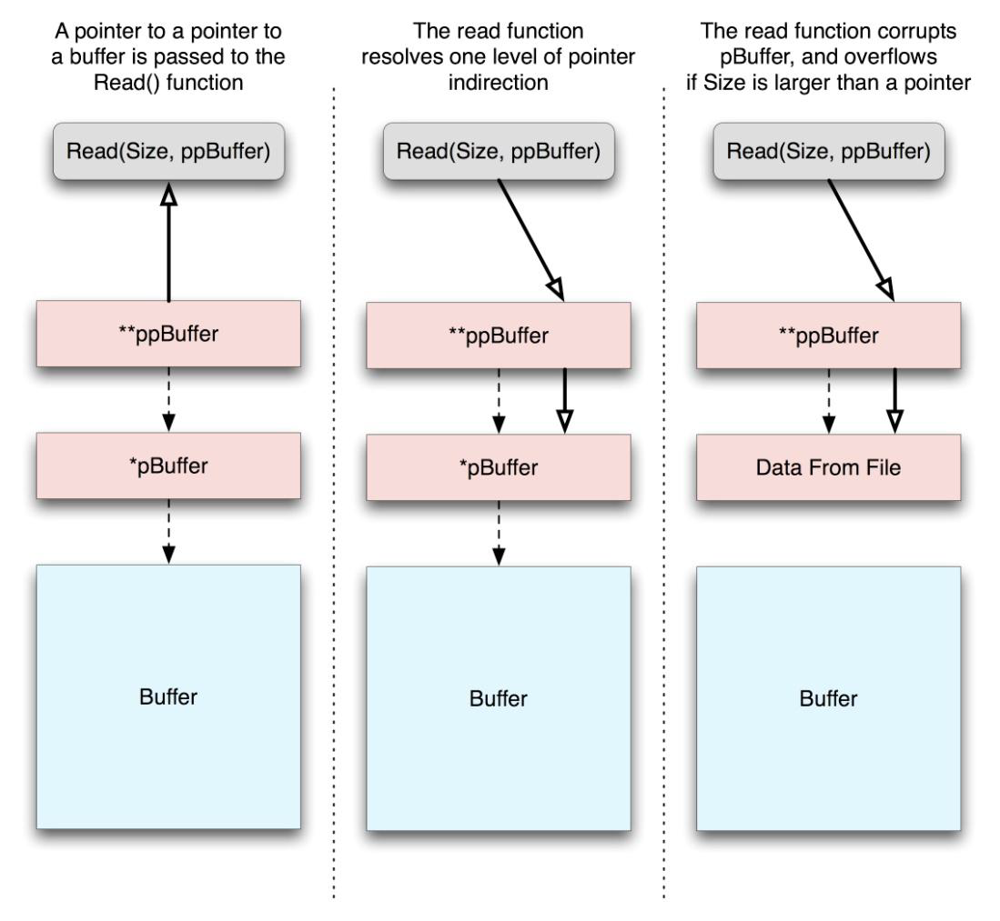</center>
<font color='#0000dd'><center>图21	有类型混淆漏洞导致的内存损坏示意图</center></font>

作者评论：在编写这个漏洞的示例代码时，作者意外地将错误的值写入pStream-> Read（）的参数 – 而导致了另一个混淆错误！当在同行的审计过程中发现时，另一位作者纠正了它，给出了不同但同样错误的值！ 我想这段代码从来都不是安全的。

###基础知识：联合的构造

正如引言中所提到的，大多数类型的混淆漏洞主要是由于滥用联合数据类型而引起的。 在C和C ++中，联合数据类型类似于结构体数据类型——结构体由许多不同名称和类型的成员组成，每个成员都可以单独引用，但是联合的成员都占用内存中的相同位置，从而使它们的用法互斥。 因此，这些类型的存在引入了错误地引用无效联合成员的可能性，例如在以下示例中：

```
struct VariantType
{
	union {
		char *string_member;
		int int_member;
	};
};
int Respond(int clientSock, struct VariantType *pVar);
int HandleNetworkMsg(int clientSock);
int Respond(int clientSock, struct VariantType *pVar)
{
	int len;
	int sentLen;
	if (pVar == NULL)
		return(0);
	len = strlen(pVar->string_member);
	sentLen = send(clientSock, pVar->string_member, len + 1, 0);
	if (sentLen != len + 1)
		return(0);
	return(1);
}
int HandleNetworkMsg(int clientSock)
{
	struct VariantType myData;
	char inBuf[1024];
	int msgSize;
	int respCode;
	memset(inBuf, 0x00, sizeof(inBuf));
	msgSize = recv(clientSock, inBuf, sizeof(inBuf), 0);
	if (msgSize < sizeof(int))
		return(0);
	memcpy(&myData.int_member, inBuf, sizeof(int));
	respCode = Respond(clientSock, &myData);
	return(respCode);
}
```

从这里可以看出，整数存储在联合中，即int_member。然后是可访问的 string_member变量，其类型为char \*。 显然，将整数视为字符串是无效的。 此代码构造将导致存储在int_member中的整数被错误地解释为char \*，从而导致应用程序作用于攻击者选择的内存的任意部分，就像它是一个字符串一样。 编译器允许此代码在没有警告的情况下进行编译，因为联合类型的特性就是便于使用不同的基本数据类型访问内存，并为程序员提供动力以跟踪哪个联合成员适合在特定情况下访问。
当然，上面的代码结构在代码中很少发生。 但是，当联合被指定为值时，联合的消费者如何知道联合中包含哪些数据类型的数据？ 答案是他们不能。 没有固有的语言设施来确定这些信息。 相反，程序员必须外在地指出联合中包含的数据类型。 程序员通常利用下面的数据结构来完成这项任务。

```
struct VariantType
{
	unsigned long TypeValueBits;
	union {
		char *str_member;
		int *pint_member;
		class *class_member;
		unsigned long ulong_member;
	};
};
```

此结构具有类型成员TypeValueBits，它指示联合中包含的数据类型。 实际上，整个Windows中普遍存在的VARIANT数据类型正是这种格式，稍后将重新讨论。 类型混淆漏洞的本质是要么同步指定适合访问的联合成员包含的内容，要么找到错误解释类型字段的代码。
###Microsoft类型混淆漏洞：VARIANT

正如我们之前在本文的技术概述中看到的那样，VARIANT数据结构在Microsoft代码中被广泛用来表示各种标准化，语言无关的数据类型。操作VARIANT数据结构的API已在本文的概述部分中介绍。我们现在将探讨如何直接或通过良好定义的API对VARIANT结构错误管理，触发微妙的类型混淆场景。
####VARIANT类型混淆攻击I：Permissive属性映射

如前所述，Microsoft的ATL通过分发接口的模板代码帮助开发人员快速开发COM组件。 Microsoft以抽象方式编写了模板代码，允许模板代码在各种情况下使用。但是，一些可用的代码也会产生微妙的后果。具体来说，不同的开发人员使用属性映射指定COM对象属性的方式具有一些微妙的细微差别，这就可能给攻击者带来进行类型混淆攻击的机会。
可以参考Microsoft ATL版本9中可用的以下宏，它们用于指定属性映射中的各个属性：

```
struct ATL_PROPMAP_ENTRY
{
	LPCOLESTR szDesc;
	DISPID dispid;
	const CLSID* pclsidPropPage;
	const IID* piidDispatch;
	DWORD dwOffsetData;
	DWORD dwSizeData;
	VARTYPE vt;
};
#define PROP_DATA_ENTRY(szDesc, member, vt) \ 
	{OLESTR(szDesc), 0, &CLSID_NULL, NULL, \
	offsetof(_PropMapClass, member), \
	sizeof(((_PropMapClass*)0)->member), vt},

#define PROP_ENTRY(szDesc, dispid, clsid) \ 
	{ OLESTR(szDesc), dispid, &clsid, &__uuidof(IDispatch), \
0, 0, VT_EMPTY },

#define PROP_ENTRY_EX(szDesc, dispid, clsid, iidDispatch) \ 
	{ OLESTR(szDesc), dispid, &clsid, &iidDispatch, 0, 0, VT_EMPTY },

#define PROP_ENTRY_TYPE(szDesc, dispid, clsid, vt) \ 
	{ OLESTR(szDesc), dispid, &clsid, &__uuidof(IDispatch), 0, 0, vt },

#define PROP_ENTRY_TYPE_EX(szDesc, dispid, clsid, iidDispatch, vt) \ 
	{ OLESTR(szDesc), dispid, &clsid, &iidDispatch, 0, 0, vt },
```
	
值得注意的是，PROP_ENTRY和PROP_ENTRY_EX都不需要参数来指定VARIANT类型。回想一下我们之前关于持久性的讨论，当使用这些函数时，持久性流将包含两个字节用于标识序列化数据之前的序列化类型。一旦被描述的成员被反序列化，ATL代码将调用属性映射指定的IDispatch接口的put方法用来将数据写入COM对象。简而言之，这些宏可以将任何类型的VARIANT提供给IDispatch接口的put方法，而不必强制转换为特定的数据类型。如果开发人员没有考虑put方法可能提供任意VARIANT类型，那么使用这种类型的属性声明可能会导致类型混淆问题。此类漏洞更有可能出现在Internet Explorer未使用的对象，或者在属性映射中指定但无法从Internet Explorer访问的IDispatch接口中。
开发人员也可以选择使用PROP_DATA_ENTRY（）而不是PROP_ENTRY（）。 PROP_DATA_ENTRY宏是唯一的，因为该属性的数据不会被IDispatch接口过滤。它直接把数据写入类中相应的偏移量。如果提供给宏的变量类型是VT_EMPTY，那么持久性代码将读取类中属性可用的字节数。解压缩PROP_DATA_ENTRY属性与PROP_ENTRY宏的过程如图22所示。

<center>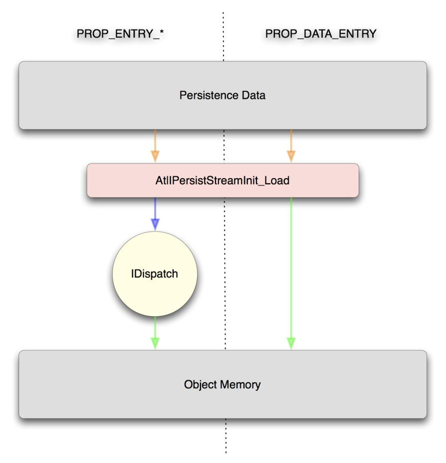</center>
<font color='#0000dd'><center>图22	PROP_ENTRY_ *宏和PROP_DATA_ENTRY的差异</center></font>


因此，使用PROP_DATA_ENTRY（）宏为攻击者提供了两个有趣的机会：

1.	直接在目标对象的内存中创建属性的能力，可能没有任何类型要求
2.	为属性提供绝对不经任何验证的能力


如果在无需类型的管理器中指定PROP_DATA_ENTRY宏，那么这些属性会非常危险。如果它们是使用指定为VT_EMPTY的类型构造的，那么使用这些属性的代码几乎肯定会包含类型混淆漏洞，因为它无法验证它正在操作的数据类型。例如在PROP_DATA_ENTRY属性在成为指向字符串或其他更复杂对象的指针的情况下，将预期对象指定为整数类型则会触发类型混淆漏洞，最终结果很可能是任意执行。此外也可能存在这样的情况：属性成员应该是整数，但攻击者指定指针（通过指定字符串或其他内容）。这种类型混淆漏洞很可能会导致信息泄露，并最终泄露指针的值。当试图绕过当代Windows操作系统中的内存保护机制时，这些类型的问题变得越来越有用。

另外一个值得注意的是：PROP_DATA_ENTRY属性是直接设置的，可以绕过IDispatch接口的put属性强制执行的任何验证级别。这意味着，在某种程度上可能存在绕过预处理过程直接设置属性的情况，因为它可能在put属性方法中执行。因此，当以某种方式对属性进行处理时，攻击者可能会成功利用我们所讨论的这些漏洞。

####VARIANT类型混淆攻击II：错误解释类型
处理VARIANT数据结构时容易出现的另一个潜在问题是正确解释vt成员。，这与NPAPI变体数据结构相反。回想一下，VARIANT中的类型参数可以是基本类型，也可以是由表示基本类型和修饰符的位组成的复杂类型（或者两个修饰符，如果其中一个是VT_BYREF）。 当错误地执行位掩码时，可能会发生对vt成员的错误解释，从而因为VARIANT值的错误解释触发漏洞。
为了说明这一点，请参考以下代码：

```
#ifndef VT_TYPEMASK 
#define VT_TYPEMASK 0xfff 
#endif 
WXDLLEXPORT bool wxConvertOleToVariant(const VARIANTARG& oleVariant, wxVariant& variant)
{
	switch (oleVariant.vt & VT_TYPEMASK)
	{
	case VT_BSTR:
	{
		wxString str(wxConvertStringFromOle(oleVariant.bstrVal));
		variant = str;
		break;
	}
	…
```

精明的读者会注意到这段代码有一个非常明显的缺陷：使用掩码执行类型检查以获得VARIANT的基本类型。 在BSTR的情况下，字符串被传递给一个基本上复制它的函数。 这里的问题是：如果使用修饰符，VARIANT值的参数里将不包含BSTR。 例如，如果此函数的调用者提供类型为（VAR_BYREF | VT_BSTR）的VARIANT，那么指向BSTR的指针放在VARIANT而不是BSTR中。 （BSTR实际上是一个WCHAR \*，其前面有32位长度，因此BSTR \*是WCHAR \*\*。）因此，在传递给此函数的VARIANT上使用任何修饰符都会导致类型混淆漏洞。

看一下这个更好一些的例子：

```
SAFEARRAY *psa;
ULONG *pValue
// Test if object is an array of integers 
VARTYPE baseType = pVarSrc->vt & VT_TYPEMASK;

if ((baseType != VT_I4 && baseType != VT_UI4) ||
	((pVarSrc->vt & VT_ARRAY) == 0))
	return -1;

psa = pVarSrc->parray;
// operate on SAFEARRAY 
SafeArrayAccessData(psa, &pValues);
...
```

这段代码检查了输入的数据类型是有符号还是无符号，如果不是，则通过返回值-1来发出错误信号。但是这段代码中也存在问题——检查变量类型时未考虑该类型可以设置VT_BYREF位。由于VT_ARRAY修饰符与VT_BYREF不互斥，因此在处理类型为（VT_BYREF | VT_ARRAY | VT_I4）的VARIANT时上述代码存在类型混淆漏洞。在这种情况下，SAFEARRAY \*\*将被错误地解释为SAFEARRAY \*，从而导致内存访问越界。

以下代码是从IE（所有现有版本）中获取的真实示例。此示例是DOM核心编组代码的一部分。这段代码负责验证来自插入DOM的脚本主机的VARIANT参数是否正确，如有必要，将这些参数转换为预期类型。尽管每个DOM函数都使用不同类型的参数，但大多数编组例程在其核心使用相同的函数VARIANTArgToCVar（），该函数采用单个VARIANT并尝试将其转换为期望的类型。易受攻击的代码如下所示：

```
int VARIANTARGToCVar(VARIANT *pSrcVar, int *res, VARTYPE vt, PVOID outVar, IServiceProvider *pProvider, BOOL bAllocString)
{
	VARIANT var;
	VariantInit(&var);
	if (!(vt & VT_BYREF))
	{
		// Type mismatch - attempt conversion 
		if ((pSrcVar->vt & (VT_BYREF | VT_TYPEMASK)) != vt && vt != VT_VARIANT)
		{
			hr = VariantChangeTypeSpecial(&var, pSrcVar, vt,
				pProvider, 0);
			if (FAILED(hr))
				return hr;
			... more stuff ...
				return hr;
		}
		switch (vt)
		{
		case VT_I2:
			*(PSHORT)outVar = pSrcVar->iVal;
			break;
		case VT_I4:
			*(PLONG)outVar = pSrcVar->lVal;
			break;
		case VT_DISPATCH:
			*(PDISPATCH)outVar = pSrcVar->pdispVal;
			break;
			... more cases ...
		}
	}
}
```

有问题的代码尝试检索输入参数pSrcVar的值，如果接收的VARIANT不是vt参数中给出的预期类型，则执行类型转换。这段代码中出现问题的地方在于接收到的输入VARIANT类型与预期类型进行比较的过程。具体来说，在输入类型被掩码为（VT_BYREF | VT_TYPEMASK）或0x4FFF时，比较结果会跳转到函数结束的分支。执行此掩码会丢失重要信息，在本例中为VT_ARRAY（0x2000）和VT_VECTOR（0x1000）修饰符。为了说明该问题，不放设置 VT_DISPATCH的期望输入类型（0x0009），设置输入VARIANT为VT_DISPATCH类型（VT_ARRAY | VT_DISPATCH或0x2009）的情况。由于（0x2009和0x4FFF）产生结果0x0009或VT_DISPATCH，因此该代码将错误地认为它接收到IDispatch对象而不是IDispatch对象数组。结果就是这个函数成功并返回指向SAFEARRAY的指针，该指针已错误地评估为指向IDispatch接口的指针。所以这段代码会导致类型混淆漏洞。

做相关漏洞审计的评审人员必须对如何操纵VARIANT的vt成员保持密切关注。具体来说，输入VARIANT类型的掩码操作必须谨慎执行，以确保在验证步骤中不会忽略信息。
####VARIANT类型混淆攻击III：直接类型操纵
另一种可能导致类型混淆漏洞的构造是不依赖于API函数直接操作VARIANT的vt成员。虽然理论上这应该是一项相当简单的任务，但是如果没有正确执行数据类型，或者没有正确确保类型转换成功，则可能会触发微妙的漏洞。例如，以下代码取自Microsoft的ATL内部版本。在持久性流执行COM对象的反序列化时会调用此代码。请注意，在这个示例中，VARIANT数据结构包装在C ++对象CComVariant中。此代码中的类成员vt对应于VARIANT结构中的vt类型变量。

上面列举的例子是人为的;然而，本文的作者已经确定了发生此类错误的真实场景。 Microsoft的内部版本的ATL具有特殊代码来处理持久性流中的变体，类似于以下示例。

```
inline HRESULT CComVariant::ReadFromStream(IStream* pStream)
{
	ATLASSERT(pStream != NULL);
	HRESULT hr;
	hr = VariantClear(this);
	if (FAILED(hr))
		return hr;
	VARTYPE vtRead;
	hr = pStream->Read(&vtRead, sizeof(VARTYPE), NULL);
	if (hr == S_FALSE)
		hr = E_FAIL;
	if (FAILED(hr))
		return hr;
	vt = vtRead;
	//Attempts to read fixed width data types here 
	CComBSTR bstrRead;
	hr = bstrRead.ReadFromStream(pStream);
	if (FAILED(hr))
		return hr;
	vt = VT_BSTR;
	bstrVal = bstrRead.Detach();
	if (vtRead != VT_BSTR)
	{
		hr = ChangeType(vtRead);
		vt = vtRead;
	}
	return hr;
}
```

上述代码的问题是是：在手动设置变体类型之前没有检查ChangeType（）函数的返回值。 此错误允许攻击者使程序相信攻击者提供的BSTR值是固定宽度数据类型处理程序中未处理的任何类型。 在一种情况下，攻击者可以指定他提供的字符串应被视为VT_DISPATCH对象的数组。 当此函数返回错误时，调用者将尝试使用VariantClear（）函数释放该字符串。 这最终导致程序将攻击者提供的字符串视为一个vtable数组，一个明确的类型混淆错误，最终允许任意代码执行。

####VARIANT类型混淆攻击IV：初始化错误
尽管VARIANT是一种相对简单的操作数据结构，但是在某些情况下，API部分的欺骗性会导致VARIANT容易被滥用。在研究本文的VARIANT用法时，作者发现一个关键错误：VarintInit（）和VariantClear（）调用不匹配。正如我们在本文前面提到的，VariantInit（）函数用于通过将vt成员设置为VT_EMPTY来初始化VARIANT结构。相反，VariantClear（）将释放与VARIANT相关的数据，同时考虑存储在那里的数据类型。随后它会将VARIANT的类型值设置为VT_EMPTY。

这里需要注意的重要一点是，在VARIANT上调用VariantClear（）时尚没有正确初始化的任何代码都可能导致潜在的安全问题。为什么？因为VariantClear（）将读取VARIANT的未初始化的vt成员，并根据它来决定如何操作未初始化的VARIANT值。例如，如果vt成员是VT_DISPATCH（0x0009），VariantClear（）将从VARIANT获取数据成员并取消引用它以进行间接调用，因为删除IDispatch对象的过程涉及调用IDispatch :: Release（）函数。 VariantInit（）函数的省略产生了一个问题，这个问题和内存管理中释放一个没有预先申请的内存块的操作类似，但有两个主要区别：

1.	Double VariantClear（）与double free（）不同 - 由于VariantClear（）将VARIANT类型设置为VT_EMPTY，因此对同一VARIANTVariantClear（）后的任何后续调用都无效 
2.	VariantInit（）的释放更像是没有malloc的free操作，因为代码在大多数情况下仍然看似正常工作，及时在攻击代码正在执行的情况下。

这类错误实际上是一个未初始化的变量问题，但是由于这类问题会引发类型混淆，所以代码出现在这一节。另外需要注意的是攻击者需要使用有用的数据来做内存布局，而不是直接指定它。也就是说，这些漏洞的可利用性非常依赖于分配VARIANT的存储器中包含的残留数据。在某些情况下，此数据受攻击者控制，而在其他情况下，攻击者只有看人品了。
```
VariantInit（）遗漏漏洞的示例如下所示：
HRESULT MyFunc(IStream* pStream)
{
	VARIANT var;
	IDispatch* pDisp;
	HRESULT hr;
	var.vt = VT_DISPATCH;
	hr = pStream->Read(pDisp, sizeof(IDispatch *), NULL);
	if (FAILED(hr)) {
		VariantClear(&var);
		return hr;
	}
	. . .
		return hr;
}
```

可以看出，位于堆栈上的VARIANT是使用类型VT_DISPATCH手动初始化的，并且可能会填充到从源流中成功读取数据后用指向IDispatch接口的指针。但是如果IStream :: Read（）操作失败，则清除VARIANT，导致未初始化的堆栈数据被操控，就像它指向IDispatch接口一样。

虽然这相对来说，是一个不太可能的错误，但有时候易受攻击的代码分支的变化会稍微微妙一些。 使用VariantCopy（）函数在VARIANT之间复制数据时会出现一个这样的情况：

VariantCopy（）函数在复制任何内容之前都会清除目标VARIANT参数。 因此，必须首先清除传递给VariantCopy（）的目标参数。 下面的代码演示了一个易受攻击的情况，在这种情况中，代码利用的限制于上一个示例相似：

```
HRESULT MyFunc(IStream* pStream)
{
	VARIANT srcVar;
	VARIANT dstVar;
	IDispatch* pDisp;
	HRESULT hr;
	srcVar.vt = VT_DISPATCH;
	dstVar.vt = VT_DISPATCH;
	hr = pStream->Read(pDisp, sizeof(IDispatch *), NULL);
	if (FAILED(hr)) {
		//VariantClear(&var); 
		return hr;
	}
	else {
		srcVar.pdispVal = pDisp;
		hr = VariantCopy(&dstVar, &srcVar);
	}
	return hr;
}
```

其他VARIANT API函数中也存在类似问题，最值得注意的是VariantChangeType（）/ VariantChangeTypeEx（）函数。 这些函数将会在一些特定的转换情况下使用VariantClear（）。 在目标值上调用VariantClear（）的时机在很大程度上是很直观的， 他们发生在：

	.	未遇到无效的转换尝试（即，不在两个不兼容的类型之间进行转换）
	.	当源和目标VARIANT相同时，VariantClear（）不会导致问题，例如VT_UNKNOWN - > VT_DISPATCH的转换过程
	
在审核漏洞方面，应该严格查看目标参数未初始化的任何转换。 例如下面这段代码：

```
BSTR *ExtractStringFromVariant(VARIANT *var)
{
	VARIANT dstVar;
	HRESULT hr;
	BSTR *res;
	if (var->vt == VT_BSTR)
		return SysAllocString(var->bstrVal);
	else {
		hr = VariantChangeType(&dstVar, var, 0, VT_BSTR);
		if (FAILED(hr))
			return NULL;
	}
	res = SysAllocString(dstVar.bstrVal);
	VariantClear(&dstVar);
	return res;
}
```

这段代码结构与上一个示例类似，除了使用VariantChangeType（）以外。漏洞利用存在几点要求：

1.	目标VARIANT没有初始化
2.	从常规类型到VT_BSTR的转换导致目标VARIANT上的VariantClear（）（例如VT_I4  - > VT_BSTR）

如上所述：攻击者需要能操纵堆栈才能成功利用漏洞，对堆栈进行操作的目的在于便于初始化的目标VARIANT中包含有用的数据，比如VT_DISPATCH类型和某种有效指针作的值。
###Mozilla类型混淆漏洞：NPAPI
大多数非IE浏览器都利用NPAPI实现插件交互，NPAPI又利用NPRuntime将脚本化对象暴露给脚本语言。用于将变量传入和传出插件的API比COM和IE使用的API简单得多，这就导致攻击面有所减少。然而，NPRuntime仍然为攻击者提供了有趣的机会，因为API自身的滥用有助于导致类型混乱漏洞，类似于我们在VARIANT中看到的漏洞。本节探讨在NPRuntime脚本化对象的上下文中发生类型混淆漏洞的机制。此讨论适用于实现NPAPI并将NPRuntime功能公开给Web内容的所有浏览器。
####NPAPI类型混淆攻击I：类型验证
我们已经看过的NPRuntime和COM VARIANT传递之间的一个主要区别是：NPRuntime不对从脚本主机接收的NPVariant执行任何类型强制转换或验证。回想一下我们之前讨论的NPRuntime插件通过使用NPVARIANT_TO_XXX（）宏访问NPVariant的过程。这些宏除了访问NPVariant中包含的union数据结构的成员之外什么都不做——插件开发人员有责任通过使用相应的NPVARIANT_IS_XXX（）宏来确保VARIANT的类型正确。正确处理NPVariant参数的插件可能如下所示：

```
bool SetProperty(NPObject *obj, NPIdentifier name, const NPVariant *variant)
{
	if (name == kTestIdent)
	{
		if (!NPVARIANT_IS_INT32(*variant))
			return false;
		gTest = NPVARIANT_TO_INT32(*variant);
		return true;
	}
	return false;
}
```

这个示例是操作NPVariants的预期算法——检查数据访问后的正确类型。 每次函数接收NPVariant时，必须在处理数据之前执行类型检查。 缺少初始检查会使代码容易出现类型混淆问题。 为了说明未能执行初始检查的问题，我们看一下从Google的“Native Client”插件中获取以下代码：

```
bool Plugin::SetProperty(NPObject* obj,
	NPIdentifier name,
	const NPVariant* variant) {
	Plugin* plugin = reinterpret_cast<Plugin*>(obj);
	if (kHeightIdent == name) {
		plugin->height_ = NPVARIANT_TO_INT32(*variant);
		return true;
```

这个函数设置相关对象的“height”属性，但无法确保被操作的NPVariant是整数。攻击者有可能将字符串或对象作为高度参数而不是整数传递，从而导致指针混淆为整数。这个代码很可能导致信息泄漏漏洞，当攻击者稍后读回高度属性时，该漏洞会泄露指针。显然，相反的情况可能更危险 - 攻击者可以提供一个整数来代替指针。根据指针的操作方式，这种情况可能导致更广泛的信息泄漏或内存损坏漏洞。

这个攻击的一个微妙的变化是NPVariant被验证为NPObject，并且插件尝试将通用NPObject强制转换为特定类型的对象。 NPAPI运行时缺少确定对象转换过程是否安全的API，所以这个构造总是适合利用的。返回Native Client，参考下面的代码：

```
static bool GetHandle(struct NaClDesc** v, NPVariant var) {
	if (NPVARIANT_IS_OBJECT(var)) {
		NPObject* obj = NPVARIANT_TO_OBJECT(var);
		UnknownHandle* handle = reinterpret_cast<UnknownHandle*>(obj);
		*v = handle->desc();
		return true;
	}
	else {
		return false;
	}
}
```

这段代码的功能是从JavaScript接收“句柄”对象。句柄对象是可编写脚本的对象的特定对象，由Native Client实现与其后端进行通信。代码使用NPVARIANT_IS_OBJECT（）宏验证了收到的NPVariant确实是一个JavaScript对象。但是，他们随后将收到的NPObject指针强制转换为UnknownHandle指针。由于攻击者可能在此处提供任意JavaScript对象，使得随机NPObject与UnknownHandle对象混淆而引发类型混淆漏洞。这种类型混淆漏洞的最可能结果是任意代码执行。

这里值得一提的是，NPObject函数的输入不是唯一提供错误输入对象的方法。如技术概述中所述，NPN_GetProperty（）函数用于从DOM层次结构中检索对象。由于这些对象受脚本控制，因此操纵DOM中可见的对象也可以执行类似的攻击。

####NPAPI类型混淆攻击II：参数计数验证
NPObject公开的Invoke（）和InvokeDefault（）方法需要验证传递给它们的参数的数量和类型，以及NPIdentifier参数标识方法的正确参数数量和类型。 对于这两个函数，只需确保argc参数的值正确即可验证参数数量。 虽然这是一个不太常见的错误，但插件开发人员要使用Invoke（）和InvokeDefault（）方法验证每个可调用函数的参数，因为它不会自动验证。 验证失败则可能导致使用无效数组索引来检索参数的情况。 下面参考一个易受攻击的代码：

```
bool Invoke(NPObject *obj, NPIdentifier name, const NPVariant *args, uint32_t argCount, NPVariant *result)
{
	if (name == kTestFuncName)
	{
		if (argCount != 2 &&
			(!NPVARIANT_IS_INT32(args[0]) || !NPVARIANT_IS_STRING(args[1])))
			return false;
		unsigned int length = NPVARIANT_TO_INT32(args[0]);
		char *buffer = ExtractString(args[1]);
		... more code ...
	}
}
```

上面的代码是出于好意 - 它试图检查参数计数以及每个参数的类型。但是，检查中存在一个问题：逻辑和（&&）运算符用于逻辑OR（||）应该在的位置。这样可能会导致利用多个不同参数通过验证并执行代码的情况出现。如果只传递一个参数，则对于args数组的第二个元素的任何操作都可能会越界访问。

上面代码的漏洞归咎于未初始化的变量的使用，而且可以认为它更适合归类为未初始化的变量问题。然而，这种错误行为源于NPVariant参数与原生变量类型比较时的相对模糊性。因此，它包含在本节中，因为它源于类型歧义，而且本节内容呼应了上一节描述的内容。

##互操作性攻击III：信任可执行模块

互操作性对执行环境提出了独特的要求。首先，应用程序需要确保它实例化的组件符合应用程序的安全要求。达到这一标准很困难，因为为互操作性而编写的组件不需要特定的环境，所以在很大程度上，它们不了解需求环境特定的安全标准。实际上，在回顾微软围绕COM的安全性时，很容易得出COM复杂性导致了这种破碎安全架构的假设。

进一步说，这个问题的事实是互操作性组件可能需要使用一个或多个子组件。假设应用程序有一种方法可以完全确保互操作性组件在应用程序的上下文中运行是安全的，那么应用程序仍然可能完全不知道审查的组件将哪些子组件带入执行环境中来的。应用程序环境或超级组件必须负责确保子组件对于执行环境是可信的。

传递信任是我们用来在主机应用程序授予的信任扩展到组件时可以依赖的条件，由组件自行决定。在Web浏览器的上下文中，实践中使用的授权模型是平坦的。也就是说，只有超级组件经过主机应用程序的显式授权检查。图23描绘了一个示例信任链。

<center>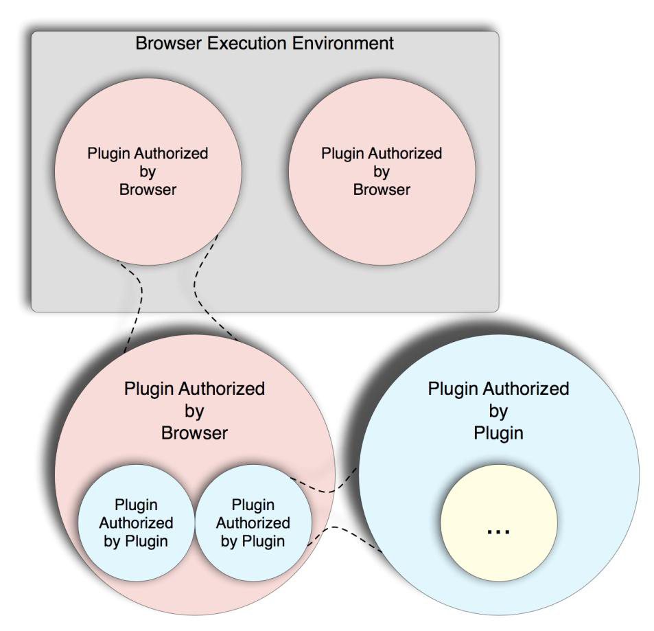</center>
<font color='#0000dd'><center>图23	浏览器插件信任链</center></font>

如图所示，强制执行安全模型的原动力完全来自超级组件。超级对象可能依赖于子对象的这种模型创建了一个信任链，其中链中的每个链接都由来自不同代码库基于不同的策略的验证过程，同时还可能拥有他们继承的信任模型的有限属性。 因此，他们可能无法以完全保真的方式强制执行该模型。此外，随着时间的推移，主机应用程序中的安全补丁通常会受到最初设计为不符合新限制的插件或组件的破坏。因此，创造性地利用插件功能的攻击者通常可以方便地绕过新的安全功能。本节将介绍作者发现的一些属于可传递信任类别的攻击 - 利用插件或组件功能来破坏内置于Web浏览器的安全功能。

###传递信任漏洞I  - 持久对象
本文已经详细讨论了持久COM对象的实现和使用，以及它们在安全性方面所面临的一些挑战。除了已经讨论过的问题之外，持久对象还为攻击者提供了使对象加载属性值的能力，有时甚至是任意类型的值。以下部分将探讨此功能对传递信任漏洞的影响，最终对绕过Internet Explorer依赖的安全功能以安全传递Web内容的方法进行简单描述。

####传递信任漏洞 - 绕过控制授权（Highlander Bit）

正如本文第二部分所讨论的，IE实现了各种控件来完成对浏览器的上下文中实例化ActiveX对象的限制，同时还会在授权浏览器上下文之前想用户呈现警告。正如我们之前所描述的，对于在Internet Explorer的执行环境中被视为安全加载的对象，需要将其标记为安全的脚本和/或安全的初始化，不得设置相关对象的killbit，最后，必须批准控件在域中运行。

首次安装Internet Explorer时会加载预先批准的列表，并且此列表的任何其他更改都将来自用户自定义。此列表限制了攻击者可以利用的控件数量，而Internet Explorer不会通知目标内容可能会破坏浏览器的安全性。此外，Microsoft一直在分发累积的killbit设置作为其每月安全更新包的一部分，以确保在IE的上下文中无法加载大量可利用的控件。实际上，在多个实例中，Microsoft都选择通过添加killbits来禁用控件，而不是在发现它们时尝试修复底层漏洞。很容易看出，从攻击者的角度来看，绕过这些授权是非常可取的，而对象持久化有助于实现这一目标。

在典型的Windows机器上有几个可用的控件，可以在不提示用户的情况下进行初始化。由于大多数自动化控件使用IPersistStream的默认ATL实现来将对象唤醒加载到内存中，可以基于这个特性利用Load（）方法实现。恢复对象的大部分工作实际上是由CComVariant :: ReadFromStream（）执行的，其实现部分显示：

```
HRESULT VariantCopy(VARIANTARG *pvargDest, VARIANTARG *pvargSrc);
HRESULT VariantCopyInd(VARIANTARG *pvargDest, VARIANTARG *pvargSrc);
inline HRESULT CComVariant::ReadFromStream(IStream* pStream)
{
	ATLASSERT(pStream != NULL);
	if (pStream == NULL)
		return E_INVALIDARG;
	HRESULT hr;
	hr = VariantClear(this);
	if (FAILED(hr))
		return hr;
	VARTYPE vtRead = VT_EMPTY;
	ULONG cbRead = 0;
	hr = pStream->Read(&vtRead, sizeof(VARTYPE), &cbRead);
	if (hr == S_FALSE || (cbRead != sizeof(VARTYPE) && hr == S_OK))
		hr = E_FAIL;
	if (FAILED(hr))
		return hr;
	vt = vtRead;
	cbRead = 0;
	switch (vtRead)
	{
	case VT_UNKNOWN:
	case VT_DISPATCH:
	{
		punkVal = NULL;
		hr = OleLoadFromStream(pStream,
			(vtRead == VT_UNKNOWN) ?
			__uuidof(IUnknown) : __uuidof(IDispatch),
			(void**)&punkVal);
		// If IPictureDisp or IFontDisp property is not set, 
		// OleLoadFromStream() will 
		// return REGDB_E_CLASSNOTREG. 
		if (hr == REGDB_E_CLASSNOTREG)
			hr = S_OK;
		return hr;
	}
	case VT_UI1:
	case VT_I1:
		cbRead = sizeof(BYTE);
		break;
		... more object types ...
	default:
		break;
	}
	... more code ...
}
```

通过查看上面的代码可以看出，当读取VT_DISPATCH或VT_UNKNOWN对象时，IStream将传递给OleLoadFromStream（）以将下级对象读入内存。 从ole32.dll导出的OleLoadFromStream（）的伪代码如下所示：

```
 HRESULT __stdcall OleLoadFromStream(LPSTREAM pStm, const IID *const iidInterface, LPVOID *ppvObj)
{
	IPersistStream *pIPersistStream;
	IUnknown *pIUnknown;
	CLSID clsidControl;
	HRESULT hrValue;
	*ppbObj = NULL;
	hrValue = ReadClassStm(pStm, &clsidControl);
	if (hrValue != ERROR_SUCCESS)
		return(hrValue);
	hrValue = CoCreateInstance(&clsidControl, NULL, \
		CLSCTX_INPROC_SERVER | CLSCTX_LOCAL_SERVER | \
		CLSCTX_REMOTE_SERVER | CLSCTX_NO_CODE_DOWNLOAD, \
		iidInterface, &pIUnknown);
	if (hrValue != ERROR_SUCCESS)
		return(hrValue);
	hrValue = pIUnknown->QueryInterface(CLSID_IPersistStream, \
		&pIPersistStream);
	if (hrValue != ERROR_SUCCESS)
		goto CleanupIUnknown;
	hrValue = pIPersistStream->Load(pStm);
	pIPersistStream->Release();
	if (hrValue != ERROR_SUCCESS)
		goto CleanupIUnknown;
	hrValue = pIUnknown->QueryInterface(iidInterface, ppvObj);
CleanupIUnknown:
	pIUnknown->Release();
	return(hrValue);
}
```

如上所示，OleLoadFromStream（）函数使用IStream中提供的CLSID调用CoCreateInstance（），然后使用持久性数据初始化控件。如果攻击者能够提供此持久性数据，那么他们可以使用此代码加载任何任意COM对象并为该对象提供持久性数据。最重要的是，没有函数来确定从属控件是否满足主机应用程序的安全要求——包括控件的killbit状态，以及可能请求用户批准的任何逻辑。应该注意的是，在撰写本文时，使用此方法似乎只提供对从持久性数据加载的控件的IPersistStream接口中的Load（）方法的访问。但是，这种功能完全足以提供一个不受安全限制影响的向量，使得该向量允许访问持久性例程中存在的漏洞以及许多以前公开的漏洞。表24列出了一小部分控件，这些控件可以满足要求，并且已有仅在对象实例化，或者通过处理持久性数据触发漏洞的报告。

|OGUID|File|
|------------|------|
|0955AC62-BF2E-4CBA-A2B9-A63F772D46CF|Msvidctl.dll|
|47C6C527-6204-4F91-849D-66E234DEE015|Srchui.dll|
|35CEC8A3-2BE6-11D2-8773-92E220524153|Stobject.dll|
|730F6CDC-2C86-11D2-8773-92E220524153|Stobject.dll|
|2C10A98F-D64F-43B4-BED6-DD0E1BF2074C|Vdt70.dll|
|6F9F3481-84DD-4B14-B09C-6B4288ECCDE8|Vdt70.dll|
|8E26BFC1-AFD6-11CF-BFFC-00AA003CFDFC|Vmhelper.dll|
|F0975AFE-5C7F-11D2-8B74-00104B2AFB41|Wbemads.dll|

<font color='#0000dd'><center>表24	可用的部分可能会触发漏洞的控件列表</center></font>


从Visual Studio 97一起发布的ATL第2版（包括ATL 8.0版）开始，与Visual Studio 2005 发行版，除PROP_DATA_ENTRY以外，没有任何机制可以对从任何宏的流中读取的属性类型进行粒度控制。因此，从流中读取的控件的大多数属性可以认为是VT_DISPATCH或VT_UNKNOWN变体。在与Visual Studio 2008一起发布的ATL 9.0版本中，未声明类型的属性条目宏被标识为不推荐使用，CComVariant :: ReadFromStream（）要求从流中读取的类型等同于宏中指定的类型，除非类型指定等于VT_EMPTY。但是，若干第三方控件（最值得注意的是Macromedia的Flash控件）具有指定VT_DISPATCH类型的属性条目，并且仍然允许这个攻击向量。此外，实现自定义Load（）方法的几个Microsoft控件也为攻击者提供了加载任意对象的能力。以下示例代码是Microsoft的ComponentTypes控件的IPersistStream实现的一部分。

```
HRESULT __stdcall CComponentTypes::Load(struct IStream *pStm)
{
	HRESULT hrVal;
	ULONG ulRead;
	long lCntComponents;
	long lIndexComponent;
	hrVal = pStm->Read(&lCntComponents, sizeof(lCntComponents), &ulRead);
	if (hrVal < ERROR_SUCCESS)
		return(hrVal);
	if (ulRead != sizeof(lCntComponents))
		return(E_UNEXPECTED);
	for (lIndexComponent = 0; \
		lIndexComponent < lCntComponents; \
		lIndexComponent++)
	{
		GUID2 ReadGuid;
		hrVal = pStm->Read(&ReadGuid, sizeof(ReadGuid), &ulRead);
		if (hrVal < ERROR_SUCCESS)
			return(hrVal);
		CComQIPtr<IPropertyBag,
			&__s_GUID const_GUID_55272a00_42cb_11ce_8135_00aa004bb851> \
			myControl;
		hrVal = CoCreateInstance(&ReadGuid, NULL, CLSCTX_INPROC_SERVER | \ CLSCTX_INPROC_HANDLER, IID_IPersistStreamInit, \ &myControl);
		if (hrVal < ERROR_SUCCESS)
			return(hrVal);
		hrVal = myControl.Load(pStm);
		if (hrVal < ERROR_SUCCESS)
			return(hrVal);
		...
```

代码读取一个整数，指定流中的控件数。 接下来，它将读入类ID并尝试从持久流加载控件。 在遇到错误或是读取许多等于流中第一个整数值的控件之前，将重复最后一步。 同样，攻击者可以指定此控件从中读取的流，而且控件在攻击者提供的持久性数据加载之前不会对此控件执行任何授权检查。

#第四节	结论
互操作性为应用程序提供了利用插件和高灵活性的好处。然而，从安全角度来看，这种灵活性的成本在很大程度上经常被忽视。我们提出了针对互操作性功能本身的攻击——从跨模块边界的数据对象的编组和管理到利用插件或核心组件的信任扩展。此外，我们已经证明，这些区域更容易受到过去只有少量或没有得到真正关注的特殊漏洞类型的影响。希望利用互操作性在不相关组件之间进行通信的应用程序的攻击者可以使用这些技术来发现数据操作代码中的细微缺陷，或者通过利用宽松的信任边界来破坏阻止安全漏洞的措施。对互操作性的进一步研究可能会产生进一步独特的开发方案，特别是在传递信任领域。这是由于安全障碍以及不断添加到Web应用程序等丰富应用程序的新组件当中。
